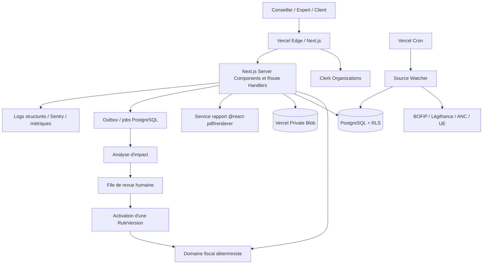
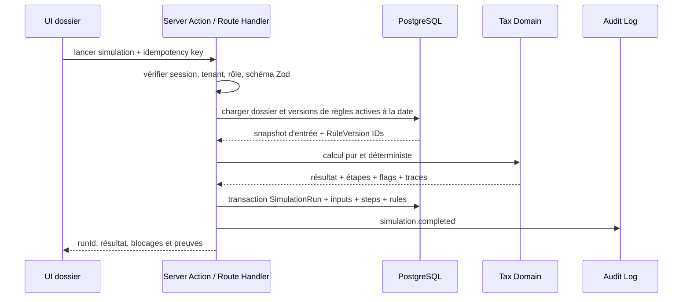
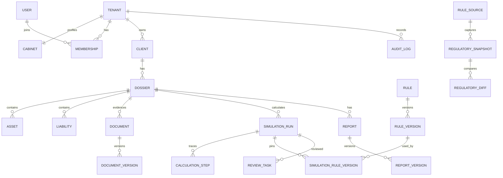
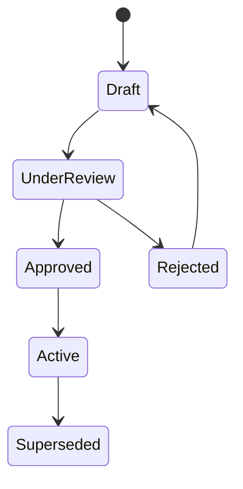
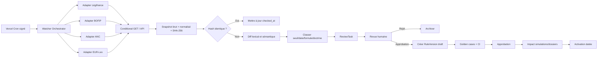
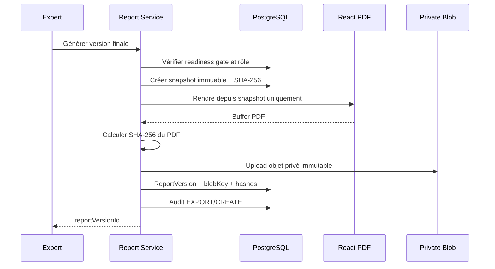
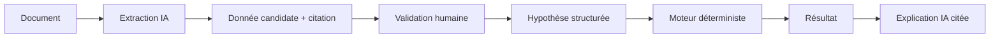

# PATRIMOINE FISCAL — ARCHITECTURE CIBLE

**Date : 18 août 2026**  
**Objectif :** SaaS B2B multi-tenant, déterministe, traçable et testable, prêt pour un pilote cabinet avant la fin de 2026 et durci au T1 2027.

---

# 1. Décisions d’architecture

## 1.1 ADR synthétique

| ID | Décision | Choix | Justification |
|---|---|---|---|
| ADR-001 | Framework | **Conserver Next.js 16 App Router** | Le dépôt est déjà en Next 16. Revenir à 15 serait une régression sans valeur. L’architecture reste compatible avec les principes Next 15+. |
| ADR-002 | Langage | TypeScript strict | Réduction des erreurs dans les moteurs et contrats. |
| ADR-003 | Base | PostgreSQL managé | Transactions, contraintes, JSONB, RLS, audit et migrations. |
| ADR-004 | ORM | **Conserver Drizzle pour le MVP** | Déjà présent ; migration Prisma risquée. Le schéma Prisma ci-dessous est une spécification logique demandée, pas une obligation de réécriture. |
| ADR-005 | Auth | Clerk Organizations + autorisation DB | Délai solo réduit ; rôles cabinet. La base reste l’autorité de tenant. |
| ADR-006 | Documents | Vercel Private Blob | Intégration Vercel, objets privés et URLs temporaires. |
| ADR-007 | PDF | `@react-pdf/renderer` côté serveur | Déjà installé, déterministe, léger et adapté au rapport structuré. |
| ADR-008 | Tests | Vitest + Playwright | Un seul runner unitaire ; Jest uniquement si héritage imposé. |
| ADR-009 | Règles fiscales | Versions immuables et datées | Reproductibilité de chaque simulation. |
| ADR-010 | Diff réglementaire | Polling CRON + snapshots + revue humaine | BOFiP/Légifrance ne fournissent pas un webhook métier universel. |
| ADR-011 | IA | Hors chemin critique fiscal | L’IA explique ou extrait ; elle ne modifie jamais le calcul déterministe. |
| ADR-012 | Audit | Append-only au niveau applicatif + RLS | Preuve des accès, validations, exports et changements. |

## 1.2 Principes non négociables

1. Une simulation référence exactement les versions de règles utilisées.
2. Une règle publiée n’est jamais modifiée ; elle est remplacée.
3. Aucun diff réglementaire n’active automatiquement une règle.
4. Le tenant est contrôlé à chaque frontière : auth, service, requête et RLS.
5. Les documents sont privés par défaut.
6. Un rapport final est un snapshot immuable, pas une vue dynamique.
7. Les calculs monétaires utilisent `numeric`/entiers, jamais `float` en base.
8. Chaque dérogation exige motif, auteur, rôle et horodatage.

---

# 2. Vue d’ensemble



## 2.1 Chemin critique d’une simulation



---

# 3. Structure de dossiers Next.js

## 3.1 Cible feature-based et domain-driven

```text
app/
  (public)/
    page.tsx
    pricing/page.tsx
    legal/page.tsx
  (auth)/
    sign-in/[[...sign-in]]/page.tsx
    sign-up/[[...sign-up]]/page.tsx
  (workspace)/
    [tenantSlug]/
      layout.tsx
      portfolio/page.tsx
      dossiers/
        page.tsx
        [dossierId]/
          layout.tsx
          page.tsx
          data/page.tsx
          documents/page.tsx
          assumptions/page.tsx
          simulations/page.tsx
          review/page.tsx
          reports/page.tsx
          history/page.tsx
      simulations/page.tsx
      review/page.tsx
      reports/page.tsx
      reference/
        rules/page.tsx
        sources/page.tsx
        diffs/page.tsx
      admin/
        members/page.tsx
        roles/page.tsx
        integrations/page.tsx
  api/
    cron/source-watcher/route.ts
    documents/[documentId]/download/route.ts
    reports/[reportVersionId]/download/route.ts
    webhooks/clerk/route.ts
    health/route.ts

src/
  domain/
    shared/
      money.ts
      dates.ts
      result.ts
      errors.ts
    tax/
      engines/
        ir-2026.ts
        pfu-2026.ts
        ifi-2026.ts
        pv-immo-2026.ts
        dutreil-2026.ts
        apport-cession-2026.ts
        holding-tax-2026.ts
      rules/
        types.ts
        resolver.ts
        validator.ts
      golden/
        cases.ts
        fixtures/
      ports/
        rule-repository.ts
        simulation-repository.ts
    dossier/
      entities.ts
      policies.ts
      ports.ts
    evidence/
      entities.ts
      policies.ts
    report/
      entities.ts
      policies.ts

  application/
    simulations/
      run-simulation.ts
      compare-scenarios.ts
      approve-simulation.ts
    dossiers/
      create-dossier.ts
      update-assumption.ts
    documents/
      upload-document.ts
      issue-download-url.ts
    reports/
      create-report-snapshot.ts
      generate-report.ts
      validate-report.ts
    regulations/
      fetch-source.ts
      create-diff.ts
      approve-rule-version.ts

  features/
    portfolio/
    dossier-header/
    data-quality/
    simulation-wizard/
    review-queue/
    report-readiness/
    rule-diff/

  components/
    ui/                 # composants shadcn copiés
    charts/             # wrappers Recharts/Tremor Raw
    pdf/                # composants @react-pdf/renderer

  infrastructure/
    auth/
      clerk.ts
      authorization.ts
      tenant-context.ts
    db/
      client.ts
      schema/            # Drizzle actuel
      repositories/
      migrations/
      rls/
    blob/
      private-blob.ts
    regulations/
      bofip-adapter.ts
      legifrance-adapter.ts
      anc-adapter.ts
      eurlex-adapter.ts
    jobs/
      outbox.ts
      worker.ts
    observability/
      logger.ts
      metrics.ts
      tracing.ts

  contracts/
    api/
    events/
    schemas/

  test/
    factories/
    fixtures/
    helpers/
```

## 3.2 Règles de dépendance

```text
UI / app / features
        ↓
application use cases
        ↓
domain pur ← ports
        ↑
infrastructure adapters
```

Le domaine fiscal :

- n’importe ni Next.js, ni ORM, ni Clerk, ni Blob ;
- accepte des entrées validées ;
- retourne résultat, étapes, drapeaux et références ;
- est exécutable en test sans réseau ni base.

## 3.3 Server Components, Server Actions et Route Handlers

- **Server Components** : lecture et composition de pages.
- **Server Actions** : mutations UI internes courtes, validées et autorisées.
- **Route Handlers** : webhooks, CRON, téléchargements, intégrations et API stable.
- Toute action sensible répète l’autorisation côté serveur ; masquer un bouton ne constitue jamais un contrôle.

---

# 4. Modèle de données

## 4.1 Principes

- PK UUID/CUID ;
- `tenant_id` sur toute table métier ;
- timestamps UTC ;
- suppression logique pour dossiers/documents, jamais pour audit/rules/runs ;
- `numeric(20,2)` pour euros et `numeric(9,6)` pour taux ;
- JSONB seulement pour snapshot immuable ou métadonnées non relationnelles ;
- contraintes et index explicités ;
- `created_by_user_id`/`approved_by_user_id` quand une responsabilité humaine existe.

## 4.2 ERD simplifié



---

# 5. Schéma Prisma de référence

> Le dépôt utilise Drizzle. Ce schéma répond à la demande de spécification Prisma et sert de modèle logique. Pour le MVP, traduire ses contraintes dans le schéma Drizzle existant plutôt que lancer une migration ORM.

```prisma
generator client {
  provider = "prisma-client-js"
}

datasource db {
  provider = "postgresql"
  url      = env("DATABASE_URL")
}

enum TenantStatus {
  TRIAL
  ACTIVE
  SUSPENDED
  CLOSED
}

enum MembershipRole {
  TENANT_ADMIN
  ADVISER
  EXPERT
  CLIENT
  AUDITOR
}

enum MembershipStatus {
  INVITED
  ACTIVE
  SUSPENDED
  REVOKED
}

enum DossierStatus {
  DRAFT
  IN_PROGRESS
  BLOCKED
  READY_FOR_REVIEW
  VALIDATED
  ARCHIVED
}

enum CaseStage {
  QUALIFICATION
  DATA_COLLECTION
  ASSUMPTIONS
  SIMULATION
  EVIDENCE
  REVIEW
  REPORT
}

enum AssetType {
  REAL_ESTATE
  SCI_SHARES
  HOLDING_SHARES
  OPERATING_COMPANY_SHARES
  SECURITIES
  CASH
  LIFE_INSURANCE
  PEA
  PER
  CRYPTO_ASSET
  BUSINESS_ASSET
  OTHER
}

enum OwnershipRight {
  FULL_OWNERSHIP
  USUFRUCT
  BARE_OWNERSHIP
  INDIVISION
}

enum LiabilityType {
  MORTGAGE
  BULLET_LOAN
  CURRENT_ACCOUNT
  TAX_DEBT
  OTHER
}

enum DocumentStatus {
  UPLOADING
  AVAILABLE
  QUARANTINED
  REJECTED
  ARCHIVED
  DELETED
}

enum DocumentClassification {
  IDENTITY
  TAX_NOTICE
  PROPERTY_DEED
  LOAN_AGREEMENT
  COMPANY_ACCOUNTS
  SHAREHOLDER_REGISTER
  DUTREIL_EVIDENCE
  DONATION_DEED
  VALUATION
  OTHER
}

enum RuleStatus {
  DRAFT
  UNDER_REVIEW
  APPROVED
  ACTIVE
  SUPERSEDED
  REJECTED
}

enum ConfidenceLevel {
  VERIFIED_LAW
  VERIFIED_DOCTRINE
  CASE_LAW_REVIEW
  PENDING_DOCTRINE
  TO_VERIFY
}

enum SourceType {
  LEGIFRANCE
  BOFIP
  IMPOTS_GOUV
  SERVICE_PUBLIC
  ANC
  EUR_LEX
  IFRS
  CASE_LAW
  MANUAL
}

enum SimulationStatus {
  QUEUED
  RUNNING
  COMPLETED
  COMPLETED_WITH_REVIEW
  FAILED
  SUPERSEDED
}

enum ReviewStatus {
  OPEN
  IN_REVIEW
  INFORMATION_REQUESTED
  APPROVED
  REJECTED
  WAIVED
}

enum ReviewSeverity {
  INFO
  REVIEW
  BLOCKING
}

enum ReportStatus {
  DRAFT
  READY_FOR_REVIEW
  VALIDATED
  DELIVERED
  SUPERSEDED
}

enum AuditAction {
  CREATE
  READ
  UPDATE
  DELETE
  EXPORT
  DOWNLOAD
  APPROVE
  REJECT
  WAIVE
  LOGIN
  LOGOUT
  INVITE
  RUN
  ACTIVATE_RULE
}

model Tenant {
  id                    String                 @id @default(cuid())
  slug                  String                 @unique
  name                  String
  status                TenantStatus           @default(TRIAL)
  dataRegion            String                 @default("eu-west")
  retentionPolicyDays   Int                    @default(3650)
  createdAt             DateTime               @default(now())
  updatedAt             DateTime               @updatedAt
  deletedAt             DateTime?

  cabinet               Cabinet?
  memberships           Membership[]
  clients               Client[]
  dossiers              Dossier[]
  assets                Asset[]
  liabilities           Liability[]
  documents             Document[]
  simulations           SimulationRun[]
  reports               Report[]
  reviewTasks           ReviewTask[]
  auditLogs             AuditLog[]
  rules                 Rule[]
  idempotencyKeys       IdempotencyKey[]

  @@index([status])
}

model Cabinet {
  id                    String   @id @default(cuid())
  tenantId              String   @unique
  legalName             String
  tradeName             String?
  siren                  String?
  professionalType      String
  addressJson           Json?
  logoBlobKey           String?
  defaultReportFooter   String?
  createdAt             DateTime @default(now())
  updatedAt             DateTime @updatedAt

  tenant                Tenant   @relation(fields: [tenantId], references: [id], onDelete: Restrict)
}

model User {
  id                    String       @id @default(cuid())
  authProviderUserId    String       @unique
  emailNormalized       String       @unique
  displayName           String
  locale                String       @default("fr-FR")
  timeZone              String       @default("Europe/Paris")
  createdAt             DateTime     @default(now())
  updatedAt             DateTime     @updatedAt
  disabledAt            DateTime?

  memberships           Membership[]
}

model Membership {
  id                    String            @id @default(cuid())
  tenantId              String
  userId                String
  role                  MembershipRole
  status                MembershipStatus  @default(INVITED)
  invitedAt             DateTime           @default(now())
  activatedAt           DateTime?
  revokedAt             DateTime?
  lastAccessAt          DateTime?

  tenant                Tenant             @relation(fields: [tenantId], references: [id], onDelete: Restrict)
  user                  User               @relation(fields: [userId], references: [id], onDelete: Restrict)

  @@unique([tenantId, userId])
  @@index([tenantId, role, status])
}

model Client {
  id                    String    @id @default(cuid())
  tenantId              String
  externalReference     String?
  displayName           String
  clientType            String
  email                 String?
  phone                 String?
  metadata              Json?
  createdAt             DateTime  @default(now())
  updatedAt             DateTime  @updatedAt
  archivedAt            DateTime?

  tenant                Tenant    @relation(fields: [tenantId], references: [id], onDelete: Restrict)
  dossiers              Dossier[]
  persons               Person[]

  @@unique([tenantId, externalReference])
  @@index([tenantId, displayName])
}

model Person {
  id                    String    @id @default(cuid())
  tenantId              String
  clientId              String
  firstName             String
  lastName              String
  birthDate             DateTime? @db.Date
  taxResidenceCountry   String    @default("FR")
  maritalStatus         String?
  metadata              Json?
  createdAt             DateTime  @default(now())
  updatedAt             DateTime  @updatedAt

  client                Client    @relation(fields: [clientId], references: [id], onDelete: Restrict)
  householdMemberships  HouseholdMember[]

  @@index([tenantId, clientId])
}

model Household {
  id                    String    @id @default(cuid())
  tenantId              String
  label                 String
  taxSituation          String
  taxParts              Decimal   @db.Decimal(6, 2)
  createdAt             DateTime  @default(now())
  updatedAt             DateTime  @updatedAt

  members               HouseholdMember[]
  dossiers              Dossier[]

  @@index([tenantId])
}

model HouseholdMember {
  householdId           String
  personId              String
  relationship          String
  isTaxDependent        Boolean   @default(false)
  validFrom             DateTime  @db.Date
  validTo               DateTime? @db.Date

  household             Household @relation(fields: [householdId], references: [id], onDelete: Restrict)
  person                Person    @relation(fields: [personId], references: [id], onDelete: Restrict)

  @@id([householdId, personId, validFrom])
}

model Dossier {
  id                    String        @id @default(cuid())
  tenantId              String
  clientId              String
  householdId           String?
  reference             String
  title                 String
  status                DossierStatus @default(DRAFT)
  currentStage          CaseStage     @default(QUALIFICATION)
  assignedMembershipId  String?
  targetCompletionDate  DateTime?     @db.Date
  fiscalYear            Int
  legalFreezeDate       DateTime?     @db.Date
  dataQualityScore      Decimal?      @db.Decimal(5, 2)
  metadata              Json?
  createdAt             DateTime      @default(now())
  updatedAt             DateTime      @updatedAt
  archivedAt            DateTime?

  tenant                Tenant        @relation(fields: [tenantId], references: [id], onDelete: Restrict)
  client                Client        @relation(fields: [clientId], references: [id], onDelete: Restrict)
  household             Household?    @relation(fields: [householdId], references: [id], onDelete: SetNull)
  assets                Asset[]
  liabilities           Liability[]
  documents             Document[]
  simulations           SimulationRun[]
  reports               Report[]
  reviews               ReviewTask[]
  assumptions           Assumption[]

  @@unique([tenantId, reference])
  @@index([tenantId, status, currentStage])
  @@index([tenantId, assignedMembershipId, targetCompletionDate])
}

model Asset {
  id                    String          @id @default(cuid())
  tenantId              String
  dossierId             String
  parentAssetId         String?
  type                  AssetType
  label                 String
  ownershipRight        OwnershipRight  @default(FULL_OWNERSHIP)
  ownershipFraction     Decimal         @default(1) @db.Decimal(9, 6)
  fairMarketValue       Decimal         @db.Decimal(20, 2)
  valuationDate         DateTime        @db.Date
  acquisitionDate       DateTime?       @db.Date
  acquisitionValue      Decimal?        @db.Decimal(20, 2)
  directlyHeld          Boolean         @default(true)
  principalResidence    Boolean         @default(false)
  professionalUseRate   Decimal         @default(0) @db.Decimal(9, 6)
  taxableFraction       Decimal         @default(1) @db.Decimal(9, 6)
  sourceDocumentId      String?
  metadata              Json?
  createdAt             DateTime        @default(now())
  updatedAt             DateTime        @updatedAt
  deletedAt             DateTime?

  tenant                Tenant          @relation(fields: [tenantId], references: [id], onDelete: Restrict)
  dossier               Dossier         @relation(fields: [dossierId], references: [id], onDelete: Restrict)
  parentAsset           Asset?          @relation("AssetHierarchy", fields: [parentAssetId], references: [id])
  childAssets           Asset[]         @relation("AssetHierarchy")
  liabilities           Liability[]

  @@index([tenantId, dossierId, type])
  @@index([tenantId, valuationDate])
}

model Liability {
  id                    String          @id @default(cuid())
  tenantId              String
  dossierId             String
  assetId               String?
  type                  LiabilityType
  label                 String
  originalPrincipal     Decimal         @db.Decimal(20, 2)
  outstandingPrincipal  Decimal         @db.Decimal(20, 2)
  valuationDate         DateTime        @db.Date
  disbursementDate      DateTime?       @db.Date
  maturityDate          DateTime?       @db.Date
  repaymentKind         String
  relatedParty          Boolean         @default(false)
  eligiblePurpose       Boolean         @default(false)
  nonTaxPurposeProven   Boolean         @default(false)
  metadata              Json?
  createdAt             DateTime        @default(now())
  updatedAt             DateTime        @updatedAt
  deletedAt             DateTime?

  tenant                Tenant          @relation(fields: [tenantId], references: [id], onDelete: Restrict)
  dossier               Dossier         @relation(fields: [dossierId], references: [id], onDelete: Restrict)
  asset                 Asset?          @relation(fields: [assetId], references: [id], onDelete: SetNull)

  @@index([tenantId, dossierId])
  @@index([tenantId, assetId])
}

model Assumption {
  id                    String    @id @default(cuid())
  tenantId              String
  dossierId             String
  key                   String
  valueJson             Json
  valueType             String
  sourceType            String
  sourceDocumentId      String?
  manualOverride        Boolean   @default(false)
  overrideReason        String?
  effectiveFrom         DateTime  @db.Date
  effectiveTo           DateTime? @db.Date
  createdByUserId       String
  createdAt             DateTime  @default(now())
  supersededAt          DateTime?

  dossier               Dossier   @relation(fields: [dossierId], references: [id], onDelete: Restrict)

  @@index([tenantId, dossierId, key, effectiveFrom])
}

model Document {
  id                    String                 @id @default(cuid())
  tenantId              String
  dossierId             String
  classification        DocumentClassification
  label                 String
  status                DocumentStatus         @default(UPLOADING)
  currentVersionNumber  Int                    @default(0)
  containsPersonalData  Boolean                @default(true)
  retentionUntil        DateTime?              @db.Date
  createdByUserId       String
  createdAt             DateTime               @default(now())
  updatedAt             DateTime               @updatedAt
  deletedAt             DateTime?

  tenant                Tenant                 @relation(fields: [tenantId], references: [id], onDelete: Restrict)
  dossier               Dossier                @relation(fields: [dossierId], references: [id], onDelete: Restrict)
  versions              DocumentVersion[]
  accessLogs            DocumentAccessLog[]

  @@index([tenantId, dossierId, classification])
  @@index([tenantId, status, retentionUntil])
}

model DocumentVersion {
  id                    String    @id @default(cuid())
  tenantId              String
  documentId            String
  versionNumber         Int
  blobKey               String
  originalFileName      String
  mimeType              String
  byteSize              BigInt
  sha256                String
  antivirusStatus       String
  extractedDataJson     Json?
  extractionModelRef    String?
  uploadedByUserId      String
  createdAt             DateTime  @default(now())

  document              Document  @relation(fields: [documentId], references: [id], onDelete: Restrict)

  @@unique([documentId, versionNumber])
  @@unique([tenantId, sha256, documentId])
  @@index([tenantId, createdAt])
}

model DocumentAccessLog {
  id                    String    @id @default(cuid())
  tenantId              String
  documentId            String
  documentVersionId     String?
  userId                String
  action                AuditAction
  purpose               String?
  ipHash                String?
  userAgentHash         String?
  occurredAt            DateTime  @default(now())

  document              Document  @relation(fields: [documentId], references: [id], onDelete: Restrict)

  @@index([tenantId, documentId, occurredAt])
  @@index([tenantId, userId, occurredAt])
}

model RuleSource {
  id                    String       @id @default(cuid())
  sourceType            SourceType
  canonicalReference    String       @unique
  title                 String
  authority             String
  canonicalUrl          String?
  pollingEnabled        Boolean      @default(true)
  pollingInterval       String       @default("daily")
  lastCheckedAt         DateTime?
  lastChangedAt         DateTime?
  currentEtag           String?
  currentLastModified   String?
  createdAt             DateTime     @default(now())
  updatedAt             DateTime     @updatedAt

  snapshots             RegulatorySnapshot[]
  rules                 Rule[]
}

model RegulatorySnapshot {
  id                    String       @id @default(cuid())
  ruleSourceId          String
  fetchedAt             DateTime     @default(now())
  effectiveObservedAt   DateTime?
  httpStatus            Int
  etag                  String?
  lastModified          String?
  contentType           String
  contentSha256         String
  normalizedTextSha256  String
  rawBlobKey            String?
  normalizedText        String?
  parserVersion         String
  metadata              Json?

  ruleSource            RuleSource   @relation(fields: [ruleSourceId], references: [id], onDelete: Restrict)
  diffsAsPrevious       RegulatoryDiff[] @relation("PreviousSnapshot")
  diffsAsCurrent        RegulatoryDiff[] @relation("CurrentSnapshot")
  ruleVersions          RuleVersion[]

  @@unique([ruleSourceId, contentSha256])
  @@index([ruleSourceId, fetchedAt])
}

model RegulatoryDiff {
  id                    String                 @id @default(cuid())
  ruleSourceId          String
  previousSnapshotId    String
  currentSnapshotId     String
  detectedAt            DateTime               @default(now())
  diffType              String
  semanticSummary       String?
  extractedChangesJson  Json?
  severity              ReviewSeverity         @default(REVIEW)
  status                ReviewStatus           @default(OPEN)
  assignedToUserId      String?
  reviewedByUserId      String?
  reviewedAt            DateTime?
  reviewNotes           String?

  previousSnapshot      RegulatorySnapshot     @relation("PreviousSnapshot", fields: [previousSnapshotId], references: [id], onDelete: Restrict)
  currentSnapshot       RegulatorySnapshot     @relation("CurrentSnapshot", fields: [currentSnapshotId], references: [id], onDelete: Restrict)

  @@unique([previousSnapshotId, currentSnapshotId])
  @@index([ruleSourceId, status, severity, detectedAt])
}

model Rule {
  id                    String       @id @default(cuid())
  tenantId              String?
  ruleSourceId          String?
  key                   String
  domain                String
  title                 String
  description           String
  createdAt             DateTime     @default(now())
  updatedAt             DateTime     @updatedAt

  tenant                Tenant?      @relation(fields: [tenantId], references: [id], onDelete: Restrict)
  source                RuleSource?  @relation(fields: [ruleSourceId], references: [id], onDelete: SetNull)
  versions              RuleVersion[]

  @@unique([tenantId, key])
  @@index([domain, key])
}

model RuleVersion {
  id                    String           @id @default(cuid())
  ruleId                String
  sourceSnapshotId      String?
  version               Int
  status                RuleStatus       @default(DRAFT)
  effectiveFrom         DateTime         @db.Date
  effectiveTo           DateTime?        @db.Date
  sourceReference       String
  sourceExtract         String?
  confidenceLevel       ConfidenceLevel
  humanReviewRequired   Boolean          @default(true)
  rulePayload           Json
  payloadSchemaVersion  String
  engineCompatibility   String
  checksumSha256        String
  supersedesVersionId   String?
  createdByUserId       String
  approvedByUserId      String?
  createdAt             DateTime         @default(now())
  approvedAt            DateTime?
  activatedAt           DateTime?

  rule                  Rule             @relation(fields: [ruleId], references: [id], onDelete: Restrict)
  sourceSnapshot        RegulatorySnapshot? @relation(fields: [sourceSnapshotId], references: [id], onDelete: SetNull)
  simulations           SimulationRuleVersion[]

  @@unique([ruleId, version])
  @@unique([ruleId, checksumSha256])
  @@index([ruleId, status, effectiveFrom, effectiveTo])
}

model SimulationRun {
  id                    String           @id @default(cuid())
  tenantId              String
  dossierId             String
  engineKey             String
  engineVersion         String
  status                SimulationStatus @default(QUEUED)
  idempotencyKey        String
  inputSnapshotJson     Json
  inputSha256           String
  outputSnapshotJson    Json?
  outputSha256          String?
  legalFreezeDate       DateTime         @db.Date
  startedAt             DateTime?
  completedAt           DateTime?
  initiatedByUserId     String
  failureCode           String?
  failureMessage        String?
  createdAt             DateTime         @default(now())

  tenant                Tenant           @relation(fields: [tenantId], references: [id], onDelete: Restrict)
  dossier               Dossier          @relation(fields: [dossierId], references: [id], onDelete: Restrict)
  ruleVersions          SimulationRuleVersion[]
  calculationSteps      CalculationStep[]
  reviews               ReviewTask[]
  reportVersions        ReportVersion[]

  @@unique([tenantId, idempotencyKey])
  @@index([tenantId, dossierId, createdAt])
  @@index([tenantId, status, createdAt])
}

model SimulationRuleVersion {
  simulationRunId       String
  ruleVersionId         String
  purpose               String

  simulationRun         SimulationRun @relation(fields: [simulationRunId], references: [id], onDelete: Restrict)
  ruleVersion           RuleVersion   @relation(fields: [ruleVersionId], references: [id], onDelete: Restrict)

  @@id([simulationRunId, ruleVersionId])
  @@index([ruleVersionId])
}

model CalculationStep {
  id                    String        @id @default(cuid())
  tenantId              String
  simulationRunId       String
  sequence              Int
  stepKey               String
  label                 String
  formula               String?
  inputJson             Json
  outputJson            Json
  legalReference        String?
  severity              ReviewSeverity @default(INFO)
  createdAt             DateTime      @default(now())

  simulationRun         SimulationRun @relation(fields: [simulationRunId], references: [id], onDelete: Restrict)

  @@unique([simulationRunId, sequence])
  @@index([tenantId, simulationRunId])
}

model ReviewTask {
  id                    String         @id @default(cuid())
  tenantId              String
  dossierId             String
  simulationRunId       String?
  type                  String
  severity              ReviewSeverity
  status                ReviewStatus   @default(OPEN)
  title                 String
  description           String
  dueAt                 DateTime?
  assignedMembershipId  String?
  createdByUserId       String
  resolvedByUserId      String?
  resolutionReason      String?
  createdAt             DateTime       @default(now())
  updatedAt             DateTime       @updatedAt
  resolvedAt            DateTime?

  tenant                Tenant         @relation(fields: [tenantId], references: [id], onDelete: Restrict)
  dossier               Dossier        @relation(fields: [dossierId], references: [id], onDelete: Restrict)
  simulationRun         SimulationRun? @relation(fields: [simulationRunId], references: [id], onDelete: Restrict)

  @@index([tenantId, status, severity, dueAt])
  @@index([tenantId, dossierId, status])
}

model Report {
  id                    String       @id @default(cuid())
  tenantId              String
  dossierId             String
  title                 String
  status                ReportStatus @default(DRAFT)
  currentVersionNumber  Int          @default(0)
  createdByUserId       String
  createdAt             DateTime     @default(now())
  updatedAt             DateTime     @updatedAt
  archivedAt            DateTime?

  tenant                Tenant       @relation(fields: [tenantId], references: [id], onDelete: Restrict)
  dossier               Dossier      @relation(fields: [dossierId], references: [id], onDelete: Restrict)
  versions              ReportVersion[]

  @@index([tenantId, dossierId, status])
}

model ReportVersion {
  id                    String       @id @default(cuid())
  tenantId              String
  reportId              String
  simulationRunId       String
  versionNumber         Int
  status                ReportStatus
  snapshotJson          Json
  snapshotSha256        String
  pdfBlobKey            String?
  pdfSha256             String?
  watermark             String?
  validationBlockJson   Json
  generatedByUserId     String
  validatedByUserId     String?
  generatedAt           DateTime     @default(now())
  validatedAt           DateTime?
  deliveredAt           DateTime?

  report                Report       @relation(fields: [reportId], references: [id], onDelete: Restrict)
  simulationRun         SimulationRun @relation(fields: [simulationRunId], references: [id], onDelete: Restrict)

  @@unique([reportId, versionNumber])
  @@unique([tenantId, snapshotSha256, reportId])
  @@index([tenantId, status, generatedAt])
}

model AuditLog {
  id                    String      @id @default(cuid())
  tenantId              String
  actorUserId           String?
  actorRole             MembershipRole?
  action                AuditAction
  entityType            String
  entityId              String
  correlationId         String?
  requestId             String?
  beforeJson            Json?
  afterJson             Json?
  reason                String?
  ipHash                String?
  userAgentHash         String?
  occurredAt            DateTime    @default(now())

  tenant                Tenant      @relation(fields: [tenantId], references: [id], onDelete: Restrict)

  @@index([tenantId, entityType, entityId, occurredAt])
  @@index([tenantId, actorUserId, occurredAt])
  @@index([correlationId])
}

model IdempotencyKey {
  id                    String    @id @default(cuid())
  tenantId              String
  key                   String
  operation             String
  requestSha256         String
  responseStatus        Int?
  responseJson          Json?
  expiresAt             DateTime
  createdAt             DateTime  @default(now())

  tenant                Tenant    @relation(fields: [tenantId], references: [id], onDelete: Restrict)

  @@unique([tenantId, key, operation])
  @@index([expiresAt])
}
```

## 5.1 Contraintes que Prisma seul ne suffit pas à exprimer

À créer en migrations SQL :

- RLS par `tenant_id` ;
- interdiction `UPDATE`/`DELETE` sur `audit_log`, `rule_version` active et snapshots de rapports ;
- contrainte d’absence de chevauchement de périodes actives pour une même règle ;
- validation `effective_to > effective_from` ;
- trigger de checksum si souhaité ;
- index GIN sur JSONB ciblés ;
- partitionnement éventuel des logs à partir du pilote.

---

# 6. Multi-tenant et RLS

## 6.1 Autorité de tenant

Le tenant ne doit jamais être accepté depuis un champ de formulaire. Il provient :

1. de la session Clerk ;
2. de l’organisation active ;
3. du mapping `Clerk Organization → Tenant` en base ;
4. d’un contexte transactionnel PostgreSQL.

## 6.2 Exemple RLS

```sql
ALTER TABLE dossier ENABLE ROW LEVEL SECURITY;
ALTER TABLE dossier FORCE ROW LEVEL SECURITY;

CREATE POLICY dossier_tenant_isolation
ON dossier
USING (tenant_id = current_setting('app.tenant_id', true))
WITH CHECK (tenant_id = current_setting('app.tenant_id', true));
```

Dans chaque transaction :

```sql
SELECT set_config('app.tenant_id', $1, true);
SELECT set_config('app.user_id', $2, true);
SELECT set_config('app.role', $3, true);
```

Les migrations et jobs de service utilisent un rôle distinct, jamais les identifiants d’un utilisateur.

## 6.3 Tests de fuite inter-tenant

- créer deux tenants avec dossiers homonymes ;
- tenter lecture par ID direct ;
- tenter export, téléchargement Blob et relation imbriquée ;
- vérifier `404` plutôt que révéler l’existence ;
- exécuter en CI à chaque modification de repository.

---

# 7. Système de règles versionnées

## 7.1 Structure YAML

```yaml
rule_id: fr.pfu.standard-investment-income
version: 2
status: active
effective_date: 2026-01-01
end_date: null
jurisdiction: FR
domain: pfu
source_ref:
  - authority: LEGIFRANCE
    citation: CGI art. 200 A
    snapshot_sha256: "..."
  - authority: LEGIFRANCE
    citation: LFSS 2026 art. 12
    snapshot_sha256: "..."
confidence_level: verified_law
human_review_required: true
engine_compatibility: ">=2.0.0 <3.0.0"
parameters:
  income_tax_rate: 0.128
  social_levy_profiles:
    standard: 0.186
    life_insurance_general: 0.172
    real_estate_capital_gain: 0.172
invariants:
  - "standard total = 0.314"
  - "life insurance social rate must not inherit standard profile"
supersedes: fr.pfu.standard-investment-income@1
created_by: user_123
approved_by: user_456
approved_at: 2026-08-18T12:00:00Z
checksum_sha256: "..."
```

## 7.2 Schéma TypeScript/Zod

```ts
import { z } from "zod";

export const RuleVersionSchema = z.object({
  ruleId: z.string().min(3),
  version: z.number().int().positive(),
  status: z.enum(["draft", "under_review", "approved", "active", "superseded", "rejected"]),
  effectiveDate: z.coerce.date(),
  endDate: z.coerce.date().nullable(),
  jurisdiction: z.literal("FR"),
  domain: z.enum([
    "ir",
    "pfu",
    "cdhr",
    "ifi",
    "pv_immo",
    "dmtg",
    "dutreil",
    "apport_cession",
    "holding_tax",
  ]),
  sourceRefs: z.array(
    z.object({
      authority: z.enum(["LEGIFRANCE", "BOFIP", "IMPOTS_GOUV", "CASE_LAW"]),
      citation: z.string().min(3),
      snapshotSha256: z.string().regex(/^[a-f0-9]{64}$/),
    }),
  ).min(1),
  confidenceLevel: z.enum([
    "verified_law",
    "verified_doctrine",
    "case_law_review",
    "pending_doctrine",
    "to_verify",
  ]),
  humanReviewRequired: z.boolean(),
  engineCompatibility: z.string(),
  parameters: z.record(z.string(), z.unknown()),
  invariants: z.array(z.string()),
  supersedes: z.string().nullable(),
  checksumSha256: z.string().regex(/^[a-f0-9]{64}$/),
}).superRefine((value, ctx) => {
  if (value.endDate && value.endDate <= value.effectiveDate) {
    ctx.addIssue({ code: "custom", message: "endDate doit être postérieure à effectiveDate" });
  }
  if (value.status === "active" && value.confidenceLevel === "to_verify") {
    ctx.addIssue({ code: "custom", message: "Une règle to_verify ne peut pas être active" });
  }
});
```

## 7.3 Résolution à une date

```ts
interface RuleResolver {
  resolve(ruleKey: string, at: Date, engineVersion: string): Promise<ImmutableRuleVersion>;
}
```

Critères :

- `status = active` ;
- `effectiveFrom <= at` ;
- `effectiveTo IS NULL OR effectiveTo >= at` ;
- compatibilité moteur ;
- checksum valide ;
- une et une seule version ; sinon erreur bloquante.

## 7.4 Activation



Une activation P0 exige idéalement deux personnes au-delà du solo : auteur et réviseur externe. Pendant la phase solo, une validation différée par un fiscaliste pilote doit être tracée avant usage client.

---

# 8. Source watcher et diff réglementaire

## 8.1 Architecture



## 8.2 Pourquoi CRON, pas « webhook officiel »

Ne pas supposer que toutes les sources officielles envoient un webhook fiable. Le mécanisme robuste :

- polling quotidien ;
- `ETag` / `Last-Modified` ;
- hash du contenu brut et normalisé ;
- retries bornés ;
- snapshot en Blob privé ;
- alerte si parseur cassé ;
- contrôle hebdomadaire manuel des sources P0.

## 8.3 Route CRON

```ts
// app/api/cron/source-watcher/route.ts
import { NextRequest, NextResponse } from "next/server";
import { runSourceWatcher } from "@/src/application/regulations/run-source-watcher";

export async function GET(request: NextRequest) {
  const authorization = request.headers.get("authorization");
  if (authorization !== `Bearer ${process.env.CRON_SECRET}`) {
    return NextResponse.json({ error: "unauthorized" }, { status: 401 });
  }

  const result = await runSourceWatcher({
    correlationId: crypto.randomUUID(),
    maxSources: 50,
  });

  return NextResponse.json(result, { status: result.failed > 0 ? 207 : 200 });
}
```

## 8.4 Planification

- sources P0 : quotidien ;
- jurisprudence ciblée : quotidien/hebdomadaire selon flux ;
- ANC/IFRS : hebdomadaire ;
- contrôle manuel : hebdomadaire avant pilote ;
- plateforme Vercel avec planification suffisamment précise : ne pas dépendre d’un CRON Hobby à fenêtre large pour une échéance critique.

## 8.5 Diff sémantique

Détecteurs déterministes :

- montant monétaire ;
- pourcentage ;
- date d’effet ;
- durée ;
- mot-clé d’abrogation ;
- ajout/suppression de catégorie ;
- changement de renvoi d’article.

Un LLM peut résumer le diff **hors activation**, avec citation du texte avant/après et statut `machine_summary_unverified`.

---

# 9. Génération PDF serveur

## 9.1 Comparatif

| Option | Avantages | Limites | Verdict |
|---|---|---|---|
| Puppeteer/Chromium | Parité HTML/CSS, captures complexes | Binaire lourd, cold start, mémoire, déterminisme plus faible | P1 si parité exacte indispensable. |
| `@react-pdf/renderer` | Déjà installé, React, déterministe, faible surface d’exécution | CSS spécifique, composants à maintenir en double | **Recommandé MVP**. |
| WeasyPrint | Excellente pagination CSS print | Service Python séparé, déploiement/ops supplémentaires | Non recommandé pour solo/Vercel au MVP. |

## 9.2 Pipeline recommandé



## 9.3 Exemple d’implémentation

```ts
import { renderToBuffer } from "@react-pdf/renderer";
import { createHash } from "node:crypto";
import { put } from "@vercel/blob";
import { ReportDocument } from "@/src/components/pdf/report-document";

export async function generateReportPdf(input: {
  tenantId: string;
  reportId: string;
  snapshot: Readonly<ReportSnapshot>;
  status: "DRAFT" | "VALIDATED";
}) {
  const snapshotCanonical = JSON.stringify(input.snapshot);
  const snapshotSha256 = createHash("sha256").update(snapshotCanonical).digest("hex");
  const watermark = input.status === "VALIDATED" ? undefined : "BROUILLON — NON VALIDÉ";

  const pdfBuffer = await renderToBuffer(
    <ReportDocument snapshot={input.snapshot} watermark={watermark} />,
  );
  const pdfSha256 = createHash("sha256").update(pdfBuffer).digest("hex");
  const blobKey = `${input.tenantId}/reports/${input.reportId}/${snapshotSha256}.pdf`;

  const blob = await put(blobKey, pdfBuffer, {
    access: "private",
    contentType: "application/pdf",
    addRandomSuffix: false,
  });

  return { blobKey: blob.pathname, snapshotSha256, pdfSha256, watermark };
}
```

## 9.4 Filigrane et validation

| Statut | Filigrane | Téléchargement client |
|---|---|---|
| DRAFT | « BROUILLON — NON VALIDÉ » | Non, sauf rôle interne. |
| READY_FOR_REVIEW | « À REVOIR » | Non. |
| VALIDATED | Aucun ou « VALIDÉ LE… » discret | Oui, URL signée. |
| SUPERSEDED | « VERSION REMPLACÉE » | Archive interne uniquement. |

Le PDF contient le bloc de validation, les versions de règles, les hypothèses et les hashes.

---

# 10. Authentification et RBAC

## 10.1 Clerk vs Auth.js

| Critère | Clerk | Auth.js v5 |
|---|---|---|
| Mise en œuvre solo | Rapide | Plus de code et d’exploitation. |
| Organisations | Native | À construire. |
| Invitations/membres | Native | À construire. |
| UI | Fournie | Personnalisable. |
| Lock-in | Plus élevé | Plus faible. |
| Coût à l’échelle | À surveiller | Infrastructure propre. |

**Choix recommandé : Clerk** jusqu’au pilote, derrière un port `IdentityProvider` pour conserver une sortie possible.

## 10.2 Matrice RBAC

| Action | Admin | Conseiller | Expert | Client | Auditeur |
|---|:---:|:---:|:---:|:---:|:---:|
| Gérer membres/roles | ✓ | — | — | — | — |
| Créer/modifier dossier | ✓ | ✓ | ✓ | Limité | Lecture |
| Lancer simulation | ✓ | ✓ | ✓ | — | Lecture |
| Modifier hypothèses sensibles | ✓ | ✓ | ✓ | Proposition | Lecture |
| Valider moteur/résultat | ✓* | — | ✓ | — | Lecture |
| Déroger à un blocage | ✓* | — | ✓ | — | Lecture |
| Générer brouillon rapport | ✓ | ✓ | ✓ | — | Lecture |
| Valider rapport final | ✓* | — | ✓ | — | Lecture |
| Télécharger document | ✓ | Selon dossier | Selon dossier | Ses documents | Selon mandat |
| Activer règle fiscale | ✓* | — | Expert dédié | — | Lecture |

`*` : séparation des tâches souhaitée ; l’auteur ne valide pas sa propre règle en production.

## 10.3 Autorisation côté serveur

```ts
export async function requirePermission(
  permission: Permission,
  resource: { tenantId: string; dossierId?: string },
): Promise<AuthorizedContext> {
  const session = await getClerkSession();
  const membership = await membershipRepository.findActive(
    session.userId,
    session.organizationId,
  );
  if (!membership || membership.tenantId !== resource.tenantId) throw notFound();
  if (!roleAllows(membership.role, permission)) throw forbidden();
  return { userId: session.userId, tenantId: membership.tenantId, role: membership.role };
}
```

---

# 11. Documents privés

## 11.1 Flux d’upload

1. autoriser utilisateur/tenant ;
2. créer `Document` en `UPLOADING` ;
3. upload privé avec clé non devinable et sans PII dans le nom ;
4. vérifier type MIME, signature magique, taille ;
5. antivirus/quarantaine ;
6. hash SHA-256 ;
7. créer `DocumentVersion` ;
8. passer `AVAILABLE` ;
9. journaliser.

## 11.2 Téléchargement

- route serveur autorisée ;
- URL signée courte ou streaming contrôlé ;
- `Content-Disposition: attachment` ;
- audit de chaque accès ;
- révocation par statut et rôle ;
- aucune URL Blob publique persistante en base.

## 11.3 Clés d’objet

```text
tenants/{tenantId}/dossiers/{dossierId}/documents/{documentId}/versions/{versionId}
tenants/{tenantId}/reports/{reportId}/versions/{reportVersionId}.pdf
regulations/{sourceId}/snapshots/{sha256}.bin
```

## 11.4 Rétention

- politique par cabinet et type de document ;
- soft delete, délai de grâce, purge asynchrone ;
- legal hold ;
- audit conservé séparément ;
- export de portabilité et suppression contrôlée.

---

# 12. API et transactions

## 12.1 Contrats

- Zod à toutes les frontières ;
- erreurs métier codées ;
- `requestId` et `correlationId` ;
- idempotency key pour simulation, génération PDF, webhook ;
- pas de calcul fiscal dans le composant React.

## 12.2 Transaction d’une simulation

Dans une transaction :

1. verrouiller/charger le dossier ;
2. résoudre les règles ;
3. créer run `RUNNING` ;
4. calculer hors accès réseau ;
5. stocker snapshot, étapes, règles et résultat ;
6. créer tâches de revue ;
7. passer `COMPLETED` ou `COMPLETED_WITH_REVIEW` ;
8. écrire audit/outbox.

Si le calcul échoue, conserver `FAILED` avec code sans données sensibles dans le message public.

## 12.3 Outbox

```sql
CREATE TABLE outbox_event (
  id uuid PRIMARY KEY,
  tenant_id text NOT NULL,
  topic text NOT NULL,
  aggregate_type text NOT NULL,
  aggregate_id text NOT NULL,
  payload jsonb NOT NULL,
  created_at timestamptz NOT NULL DEFAULT now(),
  processed_at timestamptz,
  attempts int NOT NULL DEFAULT 0
);
```

Événements : `simulation.completed`, `report.generated`, `rule.diff_detected`, `rule.activated`, `document.available`.

---

# 13. Pipeline de tests

## 13.1 Choix du runner

Utiliser **Vitest** pour :

- domaine fiscal ;
- golden cases ;
- repositories avec base éphémère ;
- composants et contrats.

Ne pas maintenir Jest et Vitest pour les mêmes tests. Jest n’est conservé que si une dépendance ou un lot historique l’exige explicitement.

Utiliser **Playwright** pour les parcours E2E.

## 13.2 Pyramide

```text
                 E2E Playwright
            intégration DB / Blob / Auth
       contrats, repositories, PDF snapshots
  unités domaine + golden cases + property tests
```

## 13.3 Suites obligatoires

### Fiscal

- cas frontière exacts ;
- dates d’effet ;
- comparaison versions ;
- golden cases validés ;
- invariants : taxe jamais négative, abattement ≤ 100 %, somme de bases cohérente ;
- property tests sur plages de valeurs.

### Multi-tenant

- isolation RLS ;
- IDOR ;
- téléchargement croisé ;
- cache tenant-aware.

### PDF

- snapshot JSON ;
- présence filigrane ;
- présence bloc de validation ;
- extraction textuelle du PDF ;
- hash stable pour un snapshot et une version de renderer donnés.

### E2E

1. création dossier ;
2. qualification ;
3. upload document ;
4. saisie hypothèse ;
5. simulation ;
6. résolution blocage ;
7. validation expert ;
8. génération rapport ;
9. téléchargement signé ;
10. audit consultable.

## 13.4 Exemple Vitest

```ts
import { describe, expect, it } from "vitest";
import { runFiscalGoldenCases2026 } from "@/src/domain/tax/golden/cases";

describe("golden cases fiscaux 2026", () => {
  for (const test of runFiscalGoldenCases2026()) {
    it(test.id, () => {
      expect(test.passed, `${test.description}: ${test.actual}`).toBe(true);
    });
  }
});
```

## 13.5 CI

```mermaid
flowchart LR
  PR[Pull Request] --> LINT[ESLint + format]
  LINT --> TYPE[TypeScript strict]
  TYPE --> UNIT[Vitest unités/golden]
  UNIT --> DB[Tests PostgreSQL/RLS]
  DB --> BUILD[next build]
  BUILD --> E2E[Playwright]
  E2E --> SEC[Dependency/secret scan]
  SEC --> PREVIEW[Preview Vercel]
  PREVIEW --> REVIEW[Revue humaine]
```



Gates P0 : aucun golden fiscal en échec, aucune fuite tenant, aucune règle active non sourcée.

---

# 14. Observabilité

## 14.1 Logs structurés

Champs :

```json
{
  "timestamp": "...",
  "level": "info",
  "event": "simulation.completed",
  "requestId": "...",
  "correlationId": "...",
  "tenantIdHash": "...",
  "dossierId": "...",
  "simulationRunId": "...",
  "engineVersion": "...",
  "durationMs": 123,
  "reviewFlags": 2
}
```

Ne pas logger noms, revenus, valeurs patrimoniales ou contenu de documents.

## 14.2 Métriques

- taux de simulations réussies ;
- durée p50/p95 ;
- blocages par moteur ;
- règles proches de péremption ;
- sources non vérifiées depuis N jours ;
- échecs PDF ;
- accès Blob refusés ;
- tâches de revue en retard ;
- erreurs RLS/autorisation ;
- taux de réussite E2E pilote.

## 14.3 Alertes

P0 :

- source P0 non contrôlée depuis 48 h ;
- golden fiscal échoué ;
- tentative d’accès inter-tenant ;
- règle active sans snapshot ;
- génération de rapport final avec blocage ;
- webhook Clerk répété en échec ;
- sauvegarde/restauration non validée.

---

# 15. Sécurité

## 15.1 Menaces prioritaires

- IDOR inter-tenant ;
- documents exposés ;
- prompt injection via document si IA ;
- modification silencieuse de règle ;
- rapport forgé ou obsolète ;
- secret dans logs ;
- webhook rejoué ;
- CSV/formula injection dans exports ;
- dépendance supply-chain ;
- élévation de rôle.

## 15.2 Contrôles

- CSP, HSTS, secure cookies ;
- validation MIME + magic bytes ;
- antivirus ;
- URLs privées courtes ;
- signature webhook et anti-replay ;
- rotation secrets ;
- protection CSRF des mutations appropriées ;
- rate limiting auth/upload/simulation ;
- isolation de l’IA des documents non fiables ;
- audit append-only ;
- séparation environnements ;
- backups chiffrés et test de restauration.

---

# 16. IA runtime après stabilisation

## 16.1 Architecture autorisée



L’IA :

- ne choisit pas la version de règle ;
- ne modifie pas le résultat ;
- ne valide pas un rapport ;
- ne remplace pas le réviseur ;
- retourne une confiance et une citation ;
- est désactivable par tenant.

## 16.2 Tables additionnelles futures

- `ai_model_version` ;
- `ai_prompt_version` ;
- `ai_run` ;
- `ai_citation` ;
- `ai_evaluation_result` ;
- `ai_incident` ;
- `ai_user_feedback`.

## 16.3 Gates avant activation

- [ ] classification AI Act ;
- [ ] DPIA si nécessaire ;
- [ ] jeu d’évaluation fiscal ;
- [ ] résistance prompt injection ;
- [ ] politique de rétention fournisseur ;
- [ ] aucun entraînement sur données client ;
- [ ] logs et kill switch ;
- [ ] taux d’erreur accepté par cas d’usage ;
- [ ] transparence utilisateur.

---

# 17. Déploiement et environnements

| Environnement | Données | Usage |
|---|---|---|
| local | synthétiques | développement. |
| preview | synthétiques/seed par PR | revue et E2E. |
| staging | données pilotes pseudonymisées avec accord | recette cabinet. |
| production | données réelles | accès restreint. |

Variables :

```text
DATABASE_URL
DATABASE_DIRECT_URL
CLERK_SECRET_KEY
NEXT_PUBLIC_CLERK_PUBLISHABLE_KEY
CLERK_WEBHOOK_SECRET
BLOB_READ_WRITE_TOKEN
CRON_SECRET
SENTRY_DSN
SOURCE_WATCHER_USER_AGENT
```

Aucun secret dans `.env.example` autre que noms et descriptions.

## 17.1 Migrations

- migrations forward-only ;
- backup avant migration destructrice ;
- expansion/contract ;
- compatibilité pendant un déploiement ;
- seed de règles séparé des migrations structurelles ;
- rollback fonctionnel par feature flag, pas suppression de données.

## 17.2 Sauvegarde et reprise

Objectifs initiaux :

- RPO ≤ 24 h avant pilote, cible ≤ 1 h ensuite ;
- RTO ≤ 8 h avant pilote, cible ≤ 4 h ;
- test de restauration trimestriel puis mensuel en pilote ;
- export des règles/snapshots indépendant du fournisseur.

---

# 18. Performance

- Server Components pour réduire JS client ;
- pagination cursor pour audit, documents, simulations ;
- index composés tenant + statut/date ;
- pas de calcul fiscal dans le navigateur comme source de vérité ;
- streaming UI possible, mais résultat final transactionnel ;
- cache uniquement pour référentiels publics, jamais pour dossier sans clé tenant ;
- PDF en job si génération > limite synchrone ;
- taille document et timeout bornés.

Budgets :

| Flux | Cible p95 |
|---|---:|
| Ouverture portefeuille | < 1,5 s serveur hors réseau client |
| Ouverture dossier | < 1,5 s |
| Simulation simple | < 500 ms calcul domaine ; < 2 s bout en bout |
| Création rapport | < 10 s synchrone, sinon job |
| URL document | < 500 ms |

---

# 19. Migration depuis l’existant

## Phase A — stabiliser sans déplacer

- corriger moteurs dans `lib/tax` ;
- créer golden cases ;
- ajouter versions de règles ;
- conserver routes actuelles.

## Phase B — introduire les ports

- repositories autour de Drizzle ;
- `tenantContext` ;
- use cases applicatifs ;
- déplacer progressivement le calcul vers `src/domain`.

## Phase C — brancher Postgres/Auth/Blob

- migrations ;
- Clerk ;
- RLS ;
- documents privés ;
- import fixtures vers seed.

## Phase D — rapport et watcher

- snapshots de rapport ;
- PDF serveur ;
- snapshots réglementaires ;
- revue/activation.

## Phase E — retirer les fixtures runtime

- fixtures uniquement en tests/demo ;
- aucun fallback silencieux en production ;
- feature flag explicite `DEMO_MODE` dans un déploiement séparé.

---

# 20. Checklist d’acceptation architecture

## Données et tenant

- [ ] `tenant_id` sur toutes les tables métier.
- [ ] RLS forcée et testée.
- [ ] Aucun tenant fourni par le client n’est cru sans session.
- [ ] Migrations reproductibles.
- [ ] Backup/restauration testé.

## Fiscal

- [ ] Domaine sans dépendance framework.
- [ ] Règles immuables et datées.
- [ ] Simulations pinning des RuleVersion IDs.
- [ ] 100 % des golden cases passent.
- [ ] Aucune activation automatique après diff.

## Documents

- [ ] Blob privé.
- [ ] MIME/signature/antivirus/hash.
- [ ] URL temporaire et autorisée.
- [ ] Audit de téléchargement.
- [ ] Rétention/purge.

## Rapport

- [ ] Snapshot immuable.
- [ ] Filigrane selon statut.
- [ ] Bloc de validation.
- [ ] Hash snapshot/PDF.
- [ ] Rapport remplacé conservé.

## Auth

- [ ] Clerk Org mappée au tenant.
- [ ] RBAC côté serveur.
- [ ] séparation auteur/validateur.
- [ ] webhooks signés/idempotents.

## Watcher

- [ ] CRON signé.
- [ ] ETag/Last-Modified/hash.
- [ ] snapshot brut et normalisé.
- [ ] parseur versionné.
- [ ] tâche de revue et impact.

## Qualité

- [ ] TypeScript strict.
- [ ] Vitest + Playwright en CI.
- [ ] test RLS inter-tenant.
- [ ] observabilité sans PII.
- [ ] runbook incident.

