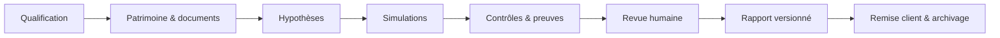

# PATRIMOINE FISCAL — AUDIT DESIGN & UX 2026

**Date de gel : 18 août 2026**  
**Périmètre :** déploiement `patrimoine-fiscal-demo.vercel.app`, dépôt `ludoviclabs-dotcom/Patrimoine-`, parcours cabinet et composants métiers.  
**Public cible :** CGP, experts-comptables, notaires et collaborateurs de cabinet, avec consultation ponctuelle par le client final.

> Ce document distingue la réalité vérifiée du dépôt de la baseline initiale du brief. Le dépôt principal est déjà sous **Next.js 16, React 19, TypeScript 5.7, Tailwind CSS 4, Drizzle ORM et `@react-pdf/renderer`**. Il ne faut donc ni revenir à Next.js 14/15, ni engager une migration ORM sans bénéfice métier immédiat.

---

# 1. Synthèse exécutive

## 1.1 Verdict

L’interface est déjà plus mature qu’une simple démo technique : elle possède une identité visuelle cohérente, une navigation cabinet, des statuts explicites, des garde-fous de revue humaine, une recherche clavier, des identifiants de runs et une bonne intention « evidence-first ». Elle reste toutefois **trop démonstrative et trop dense** pour un usage cabinet quotidien.

Le principal problème n’est pas l’esthétique. C’est la hiérarchisation opérationnelle : l’écran répète plusieurs fois le parcours en cinq étapes, multiplie les cartes et badges, et oblige l’utilisateur à lire avant de savoir **quelle action effectuer maintenant**. Sur mobile, la navigation horizontale scrollable et les tableaux longs produisent une expérience acceptable pour une démo, mais pas encore « cabinet-ready ».

### Score par dimension

| Dimension | Note / 10 | Diagnostic |
|---|---:|---|
| Cohérence visuelle | 8,0 | Palette, typographie, rayons, ombres et statuts cohérents. |
| Compréhension du parcours | 7,0 | Le parcours est clair, mais répété et trop explicatif. |
| Productivité cabinet | 5,5 | Manque de file de travail, filtres, actions en masse et raccourcis métier. |
| Densité informationnelle | 5,5 | « Card soup », textes longs, badges nombreux, redondances. |
| Confiance / traçabilité | 8,5 | Sources, runs, revue humaine et statuts visibles. |
| Mobile / mobilité cabinet | 5,5 | Responsive présent, mais navigation et tableaux doivent être repensés. |
| Accessibilité | 7,0 | Skip-link et focus visibles ; graphiques, contrastes et états restent à auditer systématiquement. |
| Prêt pour pilote cabinet | 6,5 | Bon démonstrateur ; nécessite une refonte de flux et de densité avant pilote. |

## 1.2 Décision UX centrale

Le produit doit passer d’un **site qui explique son propre parcours** à un **poste de travail qui priorise les décisions**.

La page d’accueil cabinet doit répondre en moins de cinq secondes à quatre questions :

1. Quel dossier est actif ?
2. Qu’est-ce qui bloque sa progression ?
3. Quelle est la prochaine action utile ?
4. Quel risque ou délai est le plus urgent ?

## 1.3 Priorités

### P0 — avant pilote

- Remplacer la répétition du parcours par une seule barre de progression dossier.
- Installer une « work queue » triable : action, dossier, responsable, échéance, sévérité, statut.
- Repenser les tables et alertes pour le mobile.
- Séparer clairement **complétude**, **qualité**, **preuve**, **fraîcheur** et **validation humaine**.
- Rendre le rapport non exportable tant que les blocages P0 ne sont pas levés ou explicitement dérogés.

### P1 — pilote cabinet

- Uniformiser les composants autour de shadcn/ui et Radix.
- Remplacer le radar de vigilance comme visualisation principale par une matrice lisible.
- Ajouter vues sauvegardées, filtres, raccourcis clavier et actions groupées.
- Introduire un mode « consultation mobile » distinct du mode « production bureau ».

### P2 — après stabilisation

- Personnalisation de densité, tableaux configurables et préférences cabinet.
- Micro-animations uniquement pour changement d’état, chargement et progression.
- Comparaisons temporelles et benchmarks de portefeuille.

---

# 2. Baseline vérifiée

## 2.1 Écart entre le brief et le dépôt

| Élément | Brief initial | Dépôt vérifié | Décision |
|---|---|---|---|
| Framework | Next.js 14 | Next.js 16 | Conserver Next.js 16 ; ne pas rétrograder. |
| React | Non précisé | React 19.2 | Conserver. |
| CSS | Tailwind | Tailwind 4 | Utiliser le registre shadcn compatible Tailwind 4. |
| ORM | « Pas de DB » / Prisma demandé | Drizzle et contrats Postgres déjà présents | Drizzle recommandé pour le MVP ; Prisma fourni comme schéma de référence dans `ARCHITECTURE_CIBLE.md`. |
| PDF | Navigateur uniquement | `@react-pdf/renderer` déjà installé | Finaliser la génération serveur avec cette dépendance. |
| Design primitives | Composants maison + Radix partiel | Radix, cmdk, Motion, composants internes | Migrer progressivement vers shadcn/Radix, sans réécriture big-bang. |
| Moteurs | Quelques fixtures | Plusieurs moteurs et golden cases | Corriger et versionner plutôt que reconstruire. |

## 2.2 Parcours et écrans observés

Le shell courant expose notamment :

- Accueil cabinet ;
- Dossiers ;
- Simuler ;
- Preuves & règles ;
- Revue ;
- Rapports ;
- Conformité CGP ;
- Administration.

La page `/cabinet` contient :

- un hero explicatif ;
- trois cartes de synthèse ;
- une checklist en cinq étapes ;
- un bloc de revue humaine ;
- une seconde visualisation du même parcours ;
- une liste d’alertes fiscales dérivées des moteurs.

Cette architecture est excellente pour une démonstration guidée, mais elle provoque une répétition et un scroll excessifs en production.

---

# 3. Architecture d’information cible

## 3.1 Navigation principale

La navigation doit refléter le travail cabinet et non les briques techniques.

### Proposition

1. **Portefeuille** — dossiers, échéances et alertes multi-clients.
2. **Dossier actif** — qualification, patrimoine, hypothèses, documents.
3. **Simulations** — scénarios, comparaison, versions.
4. **Revue** — contrôles, validations, dérogations.
5. **Rapports** — drafts, signés, envoyés, archivés.
6. **Référentiel** — règles, sources, diff réglementaire.
7. **Administration** — cabinet, utilisateurs, rôles, facturation, intégrations.

### Changements

- « Preuves & règles » devient **Référentiel** : vocabulaire plus court et plus durable.
- « Conformité CGP » devient une sous-section de **Revue** ou **Dossier**, sauf si c’est un module vendable autonome.
- « Simuler » devient **Simulations** : une destination de travail, pas une action isolée.
- La sélection du dossier actif reste globale et persistante.

## 3.2 Modèle mental d’un dossier



Chaque étape possède :

- un état : `not_started`, `in_progress`, `blocked`, `ready_for_review`, `validated` ;
- un propriétaire ;
- une date cible ;
- des critères de sortie mesurables ;
- des preuves liées ;
- un historique append-only.

---

# 4. Audit par composant clé

## 4.1 Dashboard dossier

| Problème actuel | Solution recommandée | Composant / pattern exact | Priorité |
|---|---|---|---:|
| Le parcours en cinq étapes apparaît plusieurs fois. | Une seule `CaseProgress` persistante, compacte, avec blocage et prochaine action. | shadcn `Progress`, `Tabs`, `Badge` + composant métier `CaseStageStepper`. | P0 |
| Trois cartes d’introduction puis plusieurs blocs répètent les mêmes états. | Limiter la première vue à quatre KPI : progression, blocages, prochaine échéance, rapport. | shadcn `Card`, `Badge`, `Tooltip`. | P0 |
| La prochaine action n’est pas suffisamment dominante. | Ajouter un panneau « À faire maintenant » avec une action primaire unique. | shadcn `Alert`, `Button`, `Card`; pattern **single primary action**. | P0 |
| Les alertes sont une liste longue sans tri opérationnel. | File de travail avec filtres, tri, responsable, date et bulk actions. | shadcn `DataTable` + TanStack Table, `DropdownMenu`, `Checkbox`, `Pagination`. | P0 |
| Les identifiants de runs occupent de l’espace visuel. | Afficher un ID court ; détail complet dans tooltip/copier. | shadcn `Tooltip`, `Button` icon-only, `Copy`. | P1 |
| Le hero consomme de la hauteur après onboarding. | Le conserver uniquement en mode démo ou premier accès ; sinon header compact. | `Collapsible` Radix ou préférence utilisateur. | P1 |
| Pas de vue portefeuille multi-dossiers priorisée. | Ajouter portefeuille avec scores de blocage, SLA et échéances. | `DataTable`, `Tabs`, `Command`, `Calendar`. | P1 |

### Layout cible desktop

```text
┌ Dossier actif / statut / responsable / dernière synchro ┐
├ Progression dossier ─── blocages ─── échéance ─── rapport ┤
├ À faire maintenant (1 CTA) ─────── Alertes critiques ─────┤
├ File de travail filtrable                                ┤
└ Activité récente / versions / commentaires               ┘
```

### Critères d’acceptation

- La prochaine action est visible sans scroll à 1366 × 768.
- Aucun contenu métier n’est dupliqué dans deux blocs de la même page.
- Un conseiller peut ouvrir un dossier bloqué en deux interactions maximum.
- Les filtres et colonnes sont encodés dans l’URL pour partage/rechargement.

---

## 4.2 Data Quality Check

### Problème actuel

La notion de « data quality » risque de se réduire à un pourcentage de complétude. Or un dossier peut être complet mais faux, ancien, non sourcé ou non validé. Le produit doit dissocier cinq dimensions :

1. **Complétude** — champs/documents présents ;
2. **Validité** — formats et règles métier ;
3. **Cohérence** — absence de contradictions ;
4. **Fraîcheur** — date de valeur et péremption ;
5. **Traçabilité** — source, auteur, preuve et validation.

| Problème actuel | Solution recommandée | Composant / pattern exact | Priorité |
|---|---|---|---:|
| Score unique opaque. | Score global + cinq sous-scores expliqués. | Tremor Raw `Tracker` ou composant `QualityDimensionBar` en Recharts ; shadcn `Tooltip`. | P0 |
| Erreurs et avertissements mélangés. | Trois niveaux : bloquant, à vérifier, information. | shadcn `Alert`, `Badge`; tokens sémantiques. | P0 |
| Pas de lien direct entre anomalie et champ. | Chaque contrôle pointe vers le champ/document et propose une résolution. | `Accordion`, `Button`, deep-link `?focus=fieldId`. | P0 |
| La provenance est secondaire. | Afficher source, date, importateur, hash et statut de revue. | shadcn `Table`, `HoverCard`, `Sheet`. | P1 |
| Table difficile sur mobile. | Liste de cartes prioritaires puis détail en Drawer. | shadcn `Card`, `Drawer`, `Accordion`. | P0 |

### Modèle d’état recommandé

```ts
type DataQualityDimension =
  | "completeness"
  | "validity"
  | "consistency"
  | "freshness"
  | "provenance";

type QualityCheckStatus = "pass" | "warning" | "fail" | "not_applicable";
```

### Visualisation

- **Desktop :** tracker horizontal par dimension, puis table des anomalies.
- **Mobile :** cartes triées par sévérité ; pas de matrice large.
- Un score ne doit jamais masquer un blocage : `92 %` avec un contrôle critique en échec reste **bloqué**.

---

## 4.3 Radar de vigilance

### Diagnostic

Un radar est visuellement attractif mais faible pour comparer précisément des valeurs, fonctionne mal avec des libellés longs et devient illisible sur petit écran. Il peut subsister comme vue secondaire de présentation, mais ne doit pas être l’outil principal de décision.

| Problème actuel | Solution recommandée | Composant / pattern exact | Priorité |
|---|---|---|---:|
| Comparaison angulaire difficile. | Matrice `Risque × Gravité × Confiance × Échéance`. | shadcn `Table` + cellules `Progress`/`Badge`. | P0 |
| Un score agrégé donne une fausse précision. | Afficher niveau, facteurs, source et règle de calcul. | `Tooltip`, `Popover`, `Sheet`. | P0 |
| Couleur seule pour distinguer les risques. | Ajouter icône, texte et motif ; descriptions accessibles. | Lucide + tokens ; `aria-label`. | P0 |
| Radar illisible en mobilité. | Barres horizontales triées par priorité. | Tremor Raw `BarList`/Recharts horizontal. | P1 |
| Pas de temporalité. | Ajouter tendance, date du dernier contrôle et prochaine échéance. | `SparkAreaChart` secondaire + texte. | P1 |

### Recommandation finale

- Vue principale : **Risk Register** triable.
- Vue secondaire : **Vigilance Snapshot** avec barres.
- Radar : uniquement export marketing/présentation, jamais seul support de décision.

---

## 4.4 Timeline

Il faut séparer deux objets actuellement susceptibles d’être confondus :

- **Timeline de production du dossier** : qualification → rapport ;
- **Timeline réglementaire et patrimoniale** : dates fiscales, engagements Dutreil, remploi 150-0 B ter, facturation électronique, prescriptions documentaires.

| Problème actuel | Solution recommandée | Composant / pattern exact | Priorité |
|---|---|---|---:|
| Répétition du parcours dans plusieurs écrans. | Un stepper compact dans le header dossier. | Composant custom sur shadcn `Progress` et `Tooltip`. | P0 |
| Les échéances n’ont pas de responsable/SLA. | Chaque événement possède owner, due date, statut et source. | shadcn `Calendar`, `Popover`, `Badge`, `Avatar`. | P0 |
| Timeline horizontale peu adaptée au mobile. | Verticale sur mobile, compacte sur desktop. | Radix `ScrollArea`; CSS grid responsive. | P0 |
| Les changements de règle ne sont pas reliés aux dossiers. | Événement réglementaire → règle → simulations impactées → tâche de revue. | `Sheet` de détail + liens croisés. | P1 |
| Pas de distinction passé/futur/à risque. | États visuels et notifications configurables. | shadcn `Badge`, `Sonner`, `DropdownMenu`. | P1 |

### Événements minimaux

- document attendu ;
- hypothèse modifiée ;
- simulation exécutée ;
- règle/version utilisée ;
- revue demandée/réalisée ;
- rapport généré/validé/remis ;
- échéance fiscale ;
- changement réglementaire impactant le dossier.

---

## 4.5 Rapport

### Problèmes

- Génération/preview orientée navigateur ;
- statut de validation insuffisamment « contractuel » ;
- mélange possible entre synthèse client et annexe technique ;
- risque d’export d’un rapport avec hypothèse non revue ;
- absence de preuve d’intégrité du binaire exporté.

| Problème actuel | Solution recommandée | Composant / pattern exact | Priorité |
|---|---|---|---:|
| Export possible sans gate forte. | `ReportReadinessGate` bloquant avant génération finale. | shadcn `AlertDialog`, `Checklist`, `Button`. | P0 |
| Statut « indicatif » peu visible dans le document. | Filigrane par statut + bandeau de validation. | `@react-pdf/renderer`, composant PDF dédié. | P0 |
| Rapport monolithique. | Deux couches : synthèse client et annexe conseiller. | shadcn `Tabs` à l’écran ; sections PDF séparées. | P0 |
| Sources longues dans le corps. | Citations courtes + annexe des règles/version/hash. | `Table` PDF ; `Footnote` métier. | P0 |
| Pas de version immuable. | Snapshot JSON + hash SHA-256 + PDF privé + audit log. | Architecture serveur, pas un composant UI. | P0 |
| Preview mobile lourde. | Afficher sommaire et cartes ; charger le PDF à la demande. | shadcn `Accordion`, `Drawer`, lien signé. | P1 |

### Bloc de validation obligatoire

Le rapport final doit afficher :

- statut : brouillon / à revoir / validé / remis ;
- identifiant du dossier et de la simulation ;
- version des règles ;
- date de calcul ;
- hypothèses déterminantes ;
- limites de couverture ;
- nom, rôle, date et mode de validation ;
- hash du snapshot et du PDF ;
- filigrane si non validé.

### Gate mesurable

Un rapport final ne peut être généré que si :

- `blocking_checks = 0` ;
- chaque moteur critique a une version active et une source non périmée ;
- chaque hypothèse sensible possède un propriétaire ;
- la revue requise est signée ;
- le snapshot est immuable.

Une dérogation nécessite un motif, un rôle autorisé et une trace d’audit.

---

## 4.6 Formulaires de simulation

### Recommandation de parcours

L’écran « Simuler » ne doit pas ouvrir directement un formulaire technique. Il doit commencer par un **intent router** :

- « Évaluer une exposition IFI » ;
- « Arbitrer PFU ou barème » ;
- « Préparer une cession immobilière » ;
- « Préparer une transmission » ;
- « Vérifier un apport-cession » ;
- « Qualifier une holding ».

Chaque intention ouvre un assistant en trois couches :

1. Questions de qualification courtes ;
2. Données/hypothèses avancées ;
3. Résultat, limites et preuves.

### Composants

- shadcn `Form` + React Hook Form + Zod ;
- `RadioGroup` pour les choix exclusifs ;
- `Command` pour actifs/documents ;
- `Popover` + `Calendar` pour dates ;
- `Input`, `Select`, `Checkbox`, `Switch` ;
- `Accordion` « Hypothèses avancées » ;
- `Alert` pour conséquences fiscales ;
- `Skeleton` pendant le calcul serveur ;
- `Sonner` uniquement pour confirmation non critique.

### Règles UX

- Les montants sont formatés à la saisie mais stockés en centimes ou `numeric` côté serveur.
- Toute valeur provenant d’un document affiche son origine.
- Toute valeur modifiée manuellement devient `manual_override` et exige un motif.
- Le résultat ne s’actualise pas silencieusement lorsque la version de règle change.

---

## 4.7 Preuves et règles

| Problème actuel | Solution | Composant | Priorité |
|---|---|---|---:|
| Sources et règles difficiles à distinguer. | Deux vues reliées : `Source` puis `RuleVersion`. | shadcn `Tabs`, `DataTable`. | P0 |
| Statut peu actionnable. | États `draft`, `under_review`, `approved`, `active`, `superseded`, `rejected`. | `Badge`, filtres. | P0 |
| Pas de comparaison lisible. | Diff sémantique avec surlignage montant/seuil/date/formule. | composant `RuleDiffViewer`; Radix `ScrollArea`. | P1 |
| Risque d’activation automatique. | Bouton d’approbation séparé, double contrôle pour règles P0. | `AlertDialog`, RBAC, audit log. | P0 |
| Pas de vue d’impact. | Liste des moteurs, dossiers et rapports utilisant la version. | `Sheet`, `DataTable`. | P1 |

---

# 5. Migration vers shadcn/ui, Radix et Tremor

## 5.1 Position de versionnement

- **shadcn/ui** n’est pas un package monolithique à figer comme une bibliothèque classique. Utiliser le registre courant compatible Tailwind 4 et conserver les composants copiés dans le dépôt.
- **Radix Primitives** convient aux comportements accessibles bas niveau lorsque shadcn ne suffit pas.
- Une version stable `@tremor/react` « v4 » n’a pas été confirmée au 18 août 2026. Ne pas ajouter une dépendance imaginaire. Utiliser soit :
  - **Tremor Raw** en composants copiés et contrôlés ;
  - la version stable vérifiée de `@tremor/react` ;
  - ou shadcn Charts/Recharts déjà maîtrisé.

Tout ajout Tremor doit porter la mention `[À VÉRIFIER AVANT INSTALLATION]` dans la PR.

## 5.2 Matrice de migration

| Besoin | Cible | Commentaire |
|---|---|---|
| Shell desktop/mobile | shadcn `Sidebar`, `Sheet` | Sidebar desktop, Sheet mobile ; supprimer le scroll horizontal de nav. |
| Recherche globale | shadcn `Command` / cmdk | Dossiers, simulations, règles, actions. |
| Sélecteur dossier | shadcn `Combobox`, `Popover` | Recherche, récents, favoris. |
| Cartes KPI | shadcn `Card` | Limiter à quatre KPI. |
| Statuts | shadcn `Badge` | Variantes sémantiques centralisées. |
| Alertes | shadcn `Alert` | Message + impact + prochaine action. |
| Formulaires | shadcn `Form` + RHF + Zod | Messages d’erreur cohérents et accessibles. |
| Tables | shadcn `DataTable` + TanStack Table | Tri, filtres, colonnes, pagination, sélection. |
| Détails latéraux | shadcn `Sheet` | Source, preuve, règle, simulation. |
| Actions destructives/validation | shadcn `AlertDialog` | Motif obligatoire si dérogation. |
| Aide contextuelle | Radix/shadcn `Tooltip`, `HoverCard` | Ne jamais cacher un élément indispensable uniquement au hover. |
| Sections avancées | shadcn `Accordion`, Radix `Collapsible` | Progressive disclosure. |
| Scroll de logs/diffs | Radix `ScrollArea` | Performance et navigation clavier. |
| Notifications | shadcn `Sonner` | Pas pour erreurs bloquantes. |
| Qualité de données | Tremor Raw `Tracker` ou Recharts | Vue compacte ; table reste la source de vérité. |
| Risques | Tremor Raw `BarList` ou Recharts | Remplace le radar principal. |
| Tendances | Tremor Raw `AreaChart` ou shadcn Chart | Toujours avec table/texte alternatif. |
| PDF | `@react-pdf/renderer` | Aucun composant Tremor dans le PDF final. |

## 5.3 Stratégie de migration sans big-bang

1. Créer `components/ui` et les tokens sémantiques.
2. Migrer shell, boutons, badges, alertes et formulaires.
3. Migrer les tables à forte valeur opérationnelle.
4. Extraire les composants métier : `CaseStageStepper`, `ReviewGate`, `EvidenceBadge`, `RuleVersionBadge`.
5. Remplacer les graphiques décoratifs.
6. Supprimer les anciens composants seulement après tests visuels et E2E.

---

# 6. Responsive mobile-first

## 6.1 Cas d’usage mobile réel

Le mobile sert surtout à :

- consulter un dossier avant rendez-vous ;
- vérifier une alerte ;
- lire une synthèse ;
- joindre/photographier un document ;
- commenter ou valider une étape limitée.

Il ne faut pas tenter de reproduire un tableur fiscal complet sur 375 px.

## 6.2 Breakpoints fonctionnels

| Largeur | Mode | Comportement |
|---:|---|---|
| 320–639 px | Consultation mobile | Bottom navigation ou menu Sheet ; cartes ; CTA sticky. |
| 640–1023 px | Tablette | Navigation Sheet, deux colonnes ponctuelles, tables condensées. |
| 1024–1439 px | Bureau compact | Sidebar repliable ; densité standard. |
| ≥ 1440 px | Bureau large | Sidebar ouverte ; table et panneau de détail côte à côte. |

## 6.3 Navigation mobile

Remplacer la barre horizontale scrollable par :

- cinq destinations maximum en bottom bar : Portefeuille, Dossier, Simulations, Revue, Plus ;
- menu `Sheet` pour Référentiel et Administration ;
- sélecteur dossier sticky sous le header ;
- bouton primaire sticky uniquement lorsqu’une action claire existe.

## 6.4 Tables

- Desktop : TanStack Table.
- Mobile : cartes avec trois informations prioritaires, bouton « Détails » vers Drawer.
- Les colonnes secondaires ne doivent pas être simplement masquées sans alternative.
- Les actions de ligne restent accessibles au clavier et au tactile.

## 6.5 Graphiques

- Pas de radar sur mobile.
- Barres horizontales ou tracker.
- `aria-describedby` avec résumé textuel.
- Bouton « Voir les données » ouvrant une table.

## 6.6 Cibles tactiles et saisie

- Cibles de 44 × 44 px minimum.
- Clavier numérique pour montants.
- Aucune action critique sur swipe seul.
- Confirmation explicite des validations et dérogations.
- Support photo/import de document avec statut d’upload persistant.

---

# 7. Design system

## 7.1 Tokens sémantiques

Ne pas coder directement « rouge », « jaune », « vert ». Utiliser :

```css
--status-info-bg;
--status-info-fg;
--status-review-bg;
--status-review-fg;
--status-blocking-bg;
--status-blocking-fg;
--status-validated-bg;
--status-validated-fg;
--surface-default;
--surface-subtle;
--surface-raised;
--border-default;
--focus-ring;
```

## 7.2 Statuts métier

| Statut | Sens | Couleur seule interdite |
|---|---|---|
| Information | Pas d’action obligatoire | Icône + libellé. |
| À vérifier | Revue nécessaire avant finalisation | Icône + libellé + responsable. |
| Bloquant | Empêche une conclusion/rapport | Icône + texte d’impact + CTA. |
| Validé | Revue signée | Check + validateur + date. |
| Périmé | Source/règle à renouveler | Horloge + date. |

## 7.3 Typographie et densité

- Serif uniquement pour titres de marque ou rapport, pas pour données denses.
- Chiffres financiers en police tabulaire/monospace.
- Corps minimum 14 px en bureau, 16 px dans les formulaires mobile.
- Trois densités possibles à terme : confortable, standard, compacte ; standard par défaut.

## 7.4 Motion

- Motion pour apparition de résultat, progression et changement d’état.
- Pas d’animation sur chaque carte au chargement en contexte métier fréquent.
- Respect de `prefers-reduced-motion`.
- Durée 120–220 ms pour micro-interactions, 250–350 ms pour Drawer/Sheet.

---

# 8. Accessibilité 2026

Objectif : **WCAG 2.2 AA** et navigation complète clavier.

Checklist :

- [ ] Contraste texte et statuts contrôlé en clair et sombre.
- [ ] Focus visible sur toutes les actions.
- [ ] Skip-link conservé et testé.
- [ ] Ordre de tabulation logique dans Sidebar, Sheet et Dialog.
- [ ] Dialogs avec titre/description accessibles.
- [ ] Erreurs de formulaire reliées par `aria-describedby`.
- [ ] Résultats de calcul annoncés via région `aria-live="polite"` sans spam.
- [ ] Graphiques accompagnés d’un résumé et d’une table.
- [ ] Statut non communiqué par la couleur seule.
- [ ] Cibles tactiles ≥ 44 px.
- [ ] Zoom 200 % sans perte de contenu.
- [ ] `prefers-reduced-motion` pris en charge.
- [ ] Export PDF avec ordre de lecture et texte sélectionnable.

---

# 9. Pages cibles

## 9.1 `/cabinet` → Portefeuille

Contenu :

- compteurs dossiers : bloqués, à revoir, prêts, en retard ;
- work queue multi-dossiers ;
- échéances 30 jours ;
- alertes réglementaires impactantes ;
- activité récente.

Supprimer le hero après onboarding.

## 9.2 `/dossiers/[id]`

Header sticky : nom, statut, conseiller, dernière mise à jour, CTA.  
Sous-navigation : Synthèse, Données, Documents, Hypothèses, Simulations, Revue, Rapport, Historique.

## 9.3 `/simulations`

- intent router ;
- scénarios récents ;
- comparaison ;
- statut de règle ;
- résultat et limites ;
- relance à partir d’une version antérieure sans écraser l’historique.

## 9.4 `/review`

- file de contrôles ;
- filtres par rôle, risque, dossier, date ;
- décision : valider, demander information, refuser, déroger ;
- motif obligatoire ;
- historique.

## 9.5 `/report`

- readiness gate ;
- preview synthèse/annexe ;
- versions ;
- bloc validation ;
- génération et téléchargement par URL signée ;
- journal d’accès.

---

# 10. Plan d’exécution UX

## P0 — 4 à 6 semaines

- [ ] Créer les tokens et variantes de statut.
- [ ] Remplacer navigation mobile par Sheet/bottom navigation.
- [ ] Construire `CaseHeader`, `CaseStageStepper`, `NextBestAction`.
- [ ] Dédupliquer `/cabinet`.
- [ ] Construire work queue et DataTable.
- [ ] Séparer dimensions de qualité de données.
- [ ] Mettre en place `ReportReadinessGate`.
- [ ] Ajouter tests Playwright desktop/mobile sur parcours critique.

## P1 — 4 semaines

- [ ] Migrer formulaires vers shadcn Form/RHF/Zod.
- [ ] Remplacer radar principal par registre de risques/barres.
- [ ] Ajouter vue d’impact des règles.
- [ ] Ajouter préférences de colonnes et vues sauvegardées.
- [ ] Ajouter visual regression sur composants critiques.

## P2 — après pilote

- [ ] Densité personnalisable.
- [ ] Tableaux configurables par cabinet.
- [ ] Commentaires collaboratifs et mentions.
- [ ] Mode client final simplifié.
- [ ] Analytique portefeuille et comparaisons temporelles.

---

# 11. Définition de « cabinet-ready » pour le design

Le design peut être déclaré prêt pour pilote lorsque :

- [ ] Un conseiller comprend le prochain travail en moins de cinq secondes.
- [ ] Un dossier bloqué est accessible en deux interactions maximum.
- [ ] Aucun écran critique ne duplique la même information métier.
- [ ] Tous les blocages ont impact, propriétaire et action.
- [ ] Toutes les tables critiques ont une alternative mobile utilisable.
- [ ] Le rapport final est impossible sans gate ou dérogation auditée.
- [ ] Les écrans clés passent WCAG 2.2 AA.
- [ ] Les scénarios Playwright passent à 375 × 812, 768 × 1024 et 1440 × 900.
- [ ] Le temps de rendu perceptible des pages critiques reste inférieur à 2,5 s au p75 du pilote.
- [ ] Les utilisateurs pilotes atteignent ≥ 80 % de réussite sur les cinq tâches principales sans assistance.

