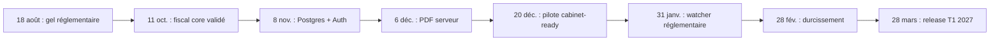

# PATRIMOINE FISCAL — ROADMAP Q3 2026 → Q1 2027

**Date de départ : 18 août 2026**  
**Cadence : sprints de deux semaines**  
**Capacité : un développeur solo, 40 à 50 heures utiles par sprint, avec 20 % de réserve.**  
**Objectif contractuel proposé : pilote cabinet testable au 20 décembre 2026 ; durcissement et lancement contrôlé au T1 2027.**

---

# 1. Principes de planification

## 1.1 Ordre de priorité imposé

1. Moteurs fiscaux LF 2026 et golden cases ;
2. PostgreSQL + Clerk multi-tenant ;
3. Rapport PDF serveur ;
4. Design system shadcn/ui et mobile ;
5. Diff réglementaire CRON + source watcher ;
6. IA runtime après stabilisation.

Aucune fonctionnalité IA ne doit consommer de capacité P0 avant la fin des gates fiscale, sécurité, rapport et pilote.

## 1.2 Hypothèses de capacité

Par sprint :

- 8 jours réellement productifs ;
- 5 à 6 heures de construction profonde par jour ;
- 1 jour cumulé pour tests, documentation et release ;
- 20 % de marge pour bugs et imprévus ;
- une seule initiative P0 dominante à la fois.

## 1.3 Rôles

| Rôle | Responsable |
|---|---|
| Architecture, code, CI, déploiement | Développeur solo |
| Validation fiscale | Fiscaliste/notaire/EC pilote externe, au moins sur cas P0 |
| Validation UX | 2 à 5 utilisateurs cabinet pilotes |
| Sécurité/tenancy | Développeur + revue ponctuelle externe recommandée |
| Décision produit | Fondateur |

## 1.4 Definition of Done globale

Une tâche n’est terminée que si :

- code en TypeScript strict ;
- tests pertinents passent ;
- aucune erreur lint/type/build ;
- logs et erreurs n’exposent pas de donnée sensible ;
- documentation/ADR mise à jour ;
- critère d’acceptation démontré ;
- preview Vercel vérifiée ;
- rollback ou feature flag prévu pour changement risqué.

---

# 2. Jalons

| Gate | Date cible | Condition |
|---|---:|---|
| G0 — Baseline sûre | 30 août 2026 | Inventaire, sources et tests actuels documentés. |
| G1 — Fiscal Core | 11 octobre 2026 | Tous moteurs P0 et golden cases validés. |
| G2 — Tenant & Data | 8 novembre 2026 | Postgres, RLS, Clerk et isolation testés. |
| G3 — Evidence & Report | 6 décembre 2026 | Documents privés et PDF serveur hashé. |
| G4 — Cabinet Pilot | 20 décembre 2026 | Parcours complet, mobile, E2E, aucun P0 ouvert. |
| G5 — Regulatory Ops | 31 janvier 2027 | Watcher, diff, revue et impact fonctionnels. |
| G6 — Controlled AI Ready | 28 février 2027 | Gouvernance et évaluations prêtes, runtime optionnel. |
| G7 — Q1 Release | 28 mars 2027 | Pilote stabilisé, sécurité, support et rollback. |

---

# 3. Vue synthétique des sprints

| Sprint | Dates | Objectif principal |
|---:|---:|---|
| S0 | 18–30 août 2026 | Gel, audit et socle de tests fiscaux. |
| S1 | 31 août–13 sept. | IR, PFU, CEHR/CDHR et IFI 2026. |
| S2 | 14–27 sept. | Plus-value immobilière et résidence principale. |
| S3 | 28 sept.–11 oct. | DMTG/Dutreil, apport-cession et taxe holding. |
| S4 | 12–25 oct. | PostgreSQL, schéma, migrations et RLS. |
| S5 | 26 oct.–8 nov. | Clerk Organizations, RBAC et tenant context. |
| S6 | 9–22 nov. | Documents privés, audit d’accès et import fixtures. |
| S7 | 23 nov.–6 déc. | PDF serveur, snapshot, filigrane et validation. |
| S8 | 7–20 déc. | Design system, mobile, parcours pilote et E2E. |
| S9 | 21 déc.–3 janv. | Freeze, correction P0 et paquet pilote. |
| S10 | 4–17 janv. 2027 | Source watcher officiel et snapshots. |
| S11 | 18–31 janv. | Diff, revue humaine, impact et activation. |
| S12 | 1–14 févr. | Observabilité, sécurité, sauvegarde et performance. |
| S13 | 15–28 févr. | Gouvernance IA, evals et prototype sans décision. |
| S14 | 1–14 mars | Pilote IA contrôlé ou report selon gates. |
| S15 | 15–28 mars | Release T1, support, pricing et dossier de preuve. |

---

# 4. Sprint S0 — Gel et sécurisation

**Dates : 18–30 août 2026**  
**Objectif livrable :** une baseline fiscale et technique reproductible, sans modification fonctionnelle silencieuse.

## P0

- Inventorier les moteurs existants et leurs points d’entrée.
- Geler les sources au 18 août 2026.
- Intégrer `MOTEURS_FISCAUX_2026.ts` comme spécification ou découper par domaine.
- Créer suite Vitest des golden cases.
- Ajouter le test de non-régression article 790.
- Documenter les écarts : Next.js 16/Drizzle vs brief initial.
- Créer une branche de travail et une checklist de migration sans supprimer les fixtures.

## P1

- Ajouter script `test:tax:golden`.
- Créer format commun `ReviewFlag`, `RuleTrace`, `CalculationStep`.
- Ajouter codeowners/review checklist pour fichiers fiscaux.

## P2

- Générer un rapport HTML des golden cases.
- Ajouter property testing exploratoire.

## Dépendances bloquantes

- Accès au dépôt et à la CI.
- Accord sur le gel réglementaire.
- Disponibilité d’un réviseur fiscal pour S1–S3.

## Critères d’acceptation

- [ ] `tsc --strict` passe.
- [ ] 20/20 golden cases initiaux passent.
- [ ] Chaque moteur possède une source et une date d’effet.
- [ ] Aucun test de démo existant n’est supprimé.
- [ ] L’erreur article 790 est reproduite puis couverte par test.
- [ ] Une note ADR confirme le maintien de Next.js 16 et Drizzle.

---

# 5. Sprint S1 — IR, PFU, CDHR et IFI

**Dates : 31 août–13 septembre 2026**  
**Objectif livrable :** simulation cabinet-testable des principaux impôts annuels 2026.

## P0

### IR

- Implémenter tranches 2026, quotient ordinaire et décote.
- Séparer CEHR et CDHR.
- Exiger un RREF CDHR validé.

### PFU

- Remplacer la constante globale 31,4 % par profils de produits.
- Conserver 17,2 % pour assurance-vie et exceptions.
- Comparaison barème/PFU au niveau foyer avec limites explicites.

### IFI

- Seuil strictement > 1,3 M€.
- Barème et décote.
- Résidence principale 30 % en détention directe.
- Dettes in fine/sans terme.
- Plafond 5 M€/60 %.
- Démembrement article 968.

### Tests

- Cas frontières ±1 € autour des seuils.
- Cas 1,3 M€, 1,31 M€, 1,4 M€.
- Cas dette 6 M€/5,5 M€.
- Cas produit à 17,2 % vs 18,6 %.

## P1

- UI de détail des étapes de calcul.
- Export JSON technique de simulation.
- Comparaison ancienne/nouvelle règle PFU.

## P2

- Plafonnement IFI à 75 % complet.
- Cas internationaux.

## Dépendances

- S0 terminé.
- Sources LFSS 2026 et BOFiP CDHR archivées.
- Validation du format de preuve par fiscaliste.

## Critères d’acceptation

- [ ] Aucun `0.314` non qualifié dans le code métier.
- [ ] Tous les profils de taux ont une source.
- [ ] CDHR impossible à valider avec RREF non confirmé.
- [ ] IFI exact à 1,3 M€ = 0 ; à 1,31 M€ = 1 445 € dans le golden case.
- [ ] Couverture branches domaine ≥ 90 % sur ces moteurs.
- [ ] Revue fiscale externe des cas P0 documentée ou statut bloquant explicite.

---

# 6. Sprint S2 — Plus-value immobilière

**Dates : 14–27 septembre 2026**  
**Objectif livrable :** calcul complet de la plus-value immobilière des particuliers pour un dossier standard.

## P0

- Calcul prix net et prix d’acquisition corrigé.
- Frais réels ou forfait 7,5 %.
- Travaux réels ou forfait 15 %.
- Tableau complet d’abattement IR 0–22 ans.
- Tableau complet prélèvements sociaux 0–30 ans.
- Taux 19 % / 17,2 %.
- Surtaxe 2–6 %.
- Qualification résidence principale.
- Blocage usufruit temporaire.
- Cas indivision/quote-part dans les entrées.

## P1

- Questionnaire de preuve résidence principale.
- Dossier documentaire : acte, factures, mandat, taxe d’habitation, consommations.
- Comparaison scénarios date de vente.

## P2

- Première cession hors résidence principale avec remploi.
- Non-résidents et conventions.
- Expropriation et dispositifs spécialisés.

## Dépendances

- Format `ReviewFlag` S0.
- Validation notariale des conditions résidence principale.
- Jeux de cas réels anonymisés.

## Critères d’acceptation

- [ ] Les 31 lignes 0–30 ans sont testées.
- [ ] Exonération IR à 22 ans et sociale à 30 ans.
- [ ] Golden case 15 ans = 29 810 €.
- [ ] Délai > un an après déménagement produit `professional_review`, pas oui/non automatique.
- [ ] Usufruit temporaire ne passe jamais dans le moteur standard.
- [ ] Rapport d’étapes cite les articles CGI.

---

# 7. Sprint S3 — Transmission, Dutreil, apport-cession et holding

**Dates : 28 septembre–11 octobre 2026**  
**Objectif livrable :** fermer les risques fiscaux les plus sensibles et atteindre Gate G1.

## P0

### DMTG / Dutreil

- Barème ligne directe et liquidation multi-liens : conjoint/PACS, fratrie, neveu/nièce, 55 % et 60 %.
- Exonérations successorales conjoint/PACS et fratrie sous conditions.
- Rappel fiscal 15 ans.
- Exonération Dutreil 75 %.
- Pivot daté : quatre ans jusqu’au 20 février 2026, six ans depuis le 21 février.
- Exclusion des actifs LF 2026 sans rétroactivité.
- Preuves holding animatrice.
- Réduction de 50 % CGI art. 790 sans condition de date erronée.

### Apport-cession

- Versions 50/60/70 % datées.
- Régime 70 % / trois ans depuis le 21 février 2026.
- Conservation cinq ans.
- États pending/maintained/broken.

### Taxe holding

- Seuil 5 M€.
- Contrôle personne physique.
- Ratio passif > 50 %.
- Liste fermée d’actifs.
- Dette logement.
- Première clôture 31 décembre 2026.

## P1

- Checklist holding animatrice.
- Simulateur de valeur exclue Dutreil.
- Timeline de remploi apport-cession.

## P2

- Apports successifs et compléments de prix avancés.
- Société étrangère et plafonnement taxe holding.

## Dépendances

- Revue fiscaliste/notaire obligatoire.
- Preuves jurisprudentielles 2025.
- Source consolidée CGI 235 ter C.

## Critères d’acceptation

- [ ] Golden test article 790 post-21 février 2026 passe.
- [ ] Golden test transmission du 10 janvier 2026 retient quatre ans.
- [ ] Golden cases conjoint/PACS et fratrie passent.
- [ ] Aucune référence fonctionnelle à `790 I` pour Dutreil.
- [ ] Cession 1er mars 2026 exige 70 % sous trois ans.
- [ ] La trésorerie n’entre pas dans l’assiette holding.
- [ ] Clôture 30 décembre 2026 = taxe 0 ; 31 décembre = éligible.
- [ ] Tous les moteurs P0 ont avis de revue ou drapeau bloquant.
- [ ] Gate G1 validée : suite fiscale verte et documentation signée.

---

# 8. Sprint S4 — PostgreSQL, schéma et RLS

**Dates : 12–25 octobre 2026**  
**Objectif livrable :** persistance réelle multi-tenant sans fuite de données.

## P0

- Finaliser schéma Drizzle aligné sur le modèle logique.
- Tables tenant, cabinet, user/membership, client, dossier, asset, liability.
- Tables rule/rule_version, simulation_run, calculation_step, audit_log.
- Migrations versionnées.
- RLS forcée sur tables métier.
- Repositories avec contexte tenant transactionnel.
- Seed Claire et Marc dans un tenant démo.
- Tests d’isolation inter-tenant.

## P1

- Outbox events.
- Idempotency keys.
- Soft delete et rétention.

## P2

- Partitionnement audit.
- Read replica.

## Dépendances

- Choix fournisseur Postgres et environnement staging.
- Convention sur identifiants.
- Schéma fiscal stabilisé G1.

## Critères d’acceptation

- [ ] Deux tenants ne peuvent jamais lire le même ID.
- [ ] Les tests IDOR renvoient 404/403 sans fuite.
- [ ] Simulation persiste inputs, outputs, steps et RuleVersion IDs.
- [ ] Aucun `tenantId` arbitraire du client n’est utilisé comme autorité.
- [ ] Migration fresh DB + seed fonctionne en une commande.
- [ ] Backup initial et restauration testée.

---

# 9. Sprint S5 — Clerk, RBAC et tenant context

**Dates : 26 octobre–8 novembre 2026**  
**Objectif livrable :** accès cabinet réel avec organisations et rôles.

## P0

- Brancher Clerk.
- Mapper Organization → Tenant.
- Synchroniser users/memberships par webhook signé et idempotent.
- Rôles admin, conseiller, expert, client, auditeur.
- Autorisation serveur sur toutes les mutations.
- Sélection de l’organisation active.
- Invitation et révocation.
- Tests d’élévation de privilège.

## P1

- Journal login/invitation/changement de rôle.
- Session timeout adapté.
- Impersonation support uniquement ultérieurement et auditée.

## P2

- SSO/SAML pour groupements.
- SCIM.

## Dépendances

- S4 et RLS.
- Compte Clerk et domaines autorisés.
- Matrice RBAC validée.

## Critères d’acceptation

- [ ] Un conseiller ne peut pas valider un rapport final.
- [ ] Un client ne voit que ses ressources autorisées.
- [ ] Webhook rejoué sans doublon.
- [ ] Révocation effective en moins d’une minute ou à la prochaine requête.
- [ ] Les actions critiques sont testées par rôle.
- [ ] Gate G2 validée.

---

# 10. Sprint S6 — Documents privés et migration des fixtures

**Dates : 9–22 novembre 2026**  
**Objectif livrable :** dossier documentaire privé et traçable.

## P0

- Brancher Vercel Private Blob.
- Upload privé par tenant/dossier.
- Validation taille, MIME et magic bytes.
- Hash SHA-256.
- Quarantaine/antivirus ou workflow de validation.
- DocumentVersion immutable.
- Download via route autorisée/URL courte.
- Audit de lecture et téléchargement.
- Import des fixtures utiles en seed, sans fallback silencieux production.

## P1

- Versionning document.
- Rétention et purge.
- Extraction structurée manuelle/import CSV sans IA.

## P2

- OCR/IA documentaire.
- Portail client d’upload avancé.

## Dépendances

- S4/S5.
- Token Blob et politique de stockage.
- Choix antivirus.

## Critères d’acceptation

- [ ] Aucun objet n’est public.
- [ ] URL expirée ou mauvais tenant = refus.
- [ ] Nom Blob sans PII.
- [ ] Hash et taille stockés.
- [ ] Chaque download produit un audit log.
- [ ] `DEMO_MODE` séparé de production.

---

# 11. Sprint S7 — Rapport PDF serveur

**Dates : 23 novembre–6 décembre 2026**  
**Objectif livrable :** rapport versionné, hashé et validable.

## P0

- Créer Report/ReportVersion.
- Snapshot immuable depuis SimulationRun.
- `@react-pdf/renderer` côté serveur.
- Filigranes DRAFT/À REVOIR/REMPLACÉ.
- Bloc de validation.
- Sources, règles et limites en annexe.
- Hash snapshot et PDF.
- Upload Blob privé.
- Gate bloquant.
- Téléchargement signé.

## P1

- Preview synthèse/annexe.
- Logo et footer cabinet.
- Historique versions.

## P2

- Signature électronique.
- Templates personnalisés avancés.

## Dépendances

- S6 Blob.
- Contenu rapport validé.
- Polices/licences autorisées.

## Critères d’acceptation

- [ ] Rapport final impossible avec blocage ouvert.
- [ ] Dérogation exige expert/admin + motif.
- [ ] Même snapshot/version renderer → hash stable dans l’environnement contrôlé.
- [ ] PDF contient run ID, rule versions, validateur et date.
- [ ] Draft affiche filigrane sur toutes les pages.
- [ ] Gate G3 validée.

---

# 12. Sprint S8 — Design system et pilote cabinet

**Dates : 7–20 décembre 2026**  
**Objectif livrable :** parcours cabinet complet, mobile et testable.

## P0

- Installer/migrer shadcn composants critiques.
- Nouveau shell responsive.
- Work queue portefeuille.
- CaseHeader + CaseStageStepper unique.
- NextBestAction.
- Data Quality cinq dimensions.
- Risk Register remplaçant radar principal.
- Tables → cartes/Drawer mobile.
- Playwright parcours complet.
- Accessibilité critique.

## P1

- Command palette.
- Vues sauvegardées.
- Raccourcis clavier.
- Micro-animations réduites.

## P2

- Densité configurable.
- Thème cabinet.

## Dépendances

- Fonctionnalités S4–S7.
- Deux utilisateurs pilotes disponibles.
- Tokens/design validés.

## Critères d’acceptation

- [ ] Prochaine action visible sans scroll à 1366 × 768.
- [ ] Parcours E2E passe à 375 × 812, 768 × 1024 et 1440 × 900.
- [ ] Aucune navigation horizontale principale mobile.
- [ ] 100 % des blocages ont action et propriétaire.
- [ ] WCAG 2.2 AA sur écrans critiques.
- [ ] Cinq tâches pilotes atteignent ≥ 80 % de réussite.
- [ ] Gate G4 validée avant le 20 décembre.

---

# 13. Sprint S9 — Freeze pilote et correction P0

**Dates : 21 décembre 2026–3 janvier 2027**  
**Objectif livrable :** version pilote gelée, sans initiative structurante pendant la période réduite.

## P0

- Freeze fonctionnel.
- Corriger uniquement P0/P1 élevés.
- Exécuter suite fiscale, RLS, E2E, PDF et backup.
- Préparer environnement pilote.
- Seed/anonymiser dossier de démonstration.
- Rédiger guide de 15 minutes et canal support.

## P1

- Instrumentation des funnels.
- FAQ et runbook.

## P2

- Aucune nouvelle fonctionnalité.

## Dépendances

- Gate G4.
- Accord pilote et convention de données.

## Critères d’acceptation

- [ ] Aucun P0 ouvert.
- [ ] Release tag immuable.
- [ ] Rollback testé.
- [ ] Sauvegarde/restauration vérifiée.
- [ ] Monitoring et contact incident actifs.
- [ ] Guide pilote remis.

---

# 14. Sprint S10 — Source watcher

**Dates : 4–17 janvier 2027**  
**Objectif livrable :** collecte automatique des sources officielles sans activation automatique.

## P0

- Source registry.
- Adapters Légifrance, BOFiP et ANC prioritaires.
- Vercel Cron signé.
- ETag/Last-Modified.
- Snapshot brut et normalisé.
- SHA-256.
- Retries et erreurs parseur.
- Tableau santé des sources.

## P1

- EUR-Lex et IFRS.
- Alertes source périmée.

## P2

- Veille jurisprudentielle large.

## Dépendances

- Contrats/conditions d’accès des sources.
- Blob/DB.
- Plan Vercel adapté.

## Critères d’acceptation

- [ ] Même contenu ne crée pas de doublon.
- [ ] Changement produit un nouveau snapshot.
- [ ] Échec source isolé des autres.
- [ ] Aucun snapshot n’active une règle.
- [ ] Source P0 non vérifiée > 48 h déclenche alerte.

---

# 15. Sprint S11 — Diff, revue et impact

**Dates : 18–31 janvier 2027**  
**Objectif livrable :** chaîne réglementaire complète jusqu’à une règle approuvée.

## P0

- Diff lexical et extraction des montants/dates/taux.
- RegulatoryDiff et ReviewTask.
- UI avant/après.
- Workflow draft → review → approved → active.
- Double contrôle logique.
- Golden cases obligatoires avant activation.
- Impact : moteurs, runs, dossiers et rapports.
- Notification aux dossiers impactés.

## P1

- Résumé LLM non fiable et clairement étiqueté, si gouvernance prête.
- Batch d’impact.

## P2

- Suggestion automatique de patch de règle, jamais activée seule.

## Dépendances

- S10.
- Règles versionnées.
- Réviseur fiscal.

## Critères d’acceptation

- [ ] Une règle `to_verify` ne peut pas devenir active.
- [ ] Une activation conserve l’ancienne version.
- [ ] Simulations historiques restent reproductibles.
- [ ] Impact listé avant activation.
- [ ] Test de bout en bout sur un changement synthétique.
- [ ] Gate G5 validée.

---

# 16. Sprint S12 — Durcissement production

**Dates : 1–14 février 2027**  
**Objectif livrable :** réduction du risque opérationnel après retours pilote.

## P0

- Corriger top 10 problèmes pilotes.
- Sentry/logs structurés et alertes.
- Rate limiting.
- CSP/HSTS.
- Scan dépendances/secrets.
- Test de restauration.
- Charge sur portefeuille, simulation, PDF.
- Revue RLS/IDOR.
- Politique de rétention.

## P1

- Dashboard SLO.
- Runbooks incident.
- Export tenant.

## P2

- DR multi-région.

## Dépendances

- Données pilote.
- Outil observabilité.
- Créneau revue sécurité.

## Critères d’acceptation

- [ ] Aucune fuite inter-tenant aux tests.
- [ ] p95 simulation < 2 s bout en bout.
- [ ] PDF respecte limite ou passe en job.
- [ ] RPO/RTO testés.
- [ ] Alertes P0 testées par injection contrôlée.

---

# 17. Sprint S13 — Gouvernance IA

**Dates : 15–28 février 2027**  
**Objectif livrable :** rendre possible un pilote IA sans dépendance dans le calcul.

## P0

- Mémo de classification AI Act.
- Inventaire cas d’usage.
- Modèles/prompts versionnés.
- Politique données fournisseur.
- Dataset d’évaluation.
- Tests prompt injection.
- Citations obligatoires.
- Human-in-the-loop.
- Kill switch tenant/global.
- Journaux et feedback.

## P1

- Prototype extraction de champs en mode suggestion.
- Prototype explication du résultat depuis données structurées.

## P2

- Chat libre.
- Recommandation autonome interdite.

## Dépendances

- Gates G1–G5.
- DPA fournisseur et configuration no-training.
- Jeu de documents synthétiques.

## Critères d’acceptation

- [ ] L’IA ne peut pas écrire directement une hypothèse validée.
- [ ] L’IA ne modifie pas un résultat fiscal.
- [ ] Chaque donnée extraite contient document/page/extrait.
- [ ] Chaque explication cite règles et limites.
- [ ] Kill switch testé.
- [ ] Gate G6 gouvernance validée, même si runtime reporté.

---

# 18. Sprint S14 — Pilote IA contrôlé ou report

**Dates : 1–14 mars 2027**  
**Objectif livrable :** un seul cas d’usage IA étroit, ou décision documentée de report.

## P0

Choisir **un** cas :

- extraction structurée d’un avis d’imposition synthétique ; ou
- explication d’une simulation validée.

Tâches :

- feature flag par tenant ;
- monitoring erreurs/coût/latence ;
- évaluation aveugle ;
- acceptation/rejet par humain ;
- incident workflow.

## P1

- Feedback utilisateur.
- Tableau qualité par modèle/prompt.

## P2

- Second cas d’usage uniquement si seuils atteints.

## Dépendances

- S13.
- Consentement pilote.
- Budget fournisseur.

## Critères d’acceptation

- [ ] Précision selon seuil défini avant test.
- [ ] 100 % des sorties sont révisables.
- [ ] Aucun faux calcul injecté dans le rapport.
- [ ] Coût/run et latence suivis.
- [ ] Si seuil non atteint, fonctionnalité désactivée sans bloquer la release.

---

# 19. Sprint S15 — Release T1 2027

**Dates : 15–28 mars 2027**  
**Objectif livrable :** version commercialisable de manière contrôlée ou beta cabinet formalisée.

## P0

- Corriger derniers P0/P1.
- Rejouer validation fiscale complète.
- Vérifier sources au jour de release.
- Revue sécurité finale.
- Conditions d’utilisation et limites produit.
- Onboarding cabinet.
- Support et SLA internes.
- Pricing Solo/Cabinet/Groupement configuré.
- Plan de rollback.
- Dossier de preuve release.

## P1

- Billing.
- Analytics activation/rétention.
- Import/export cabinet.

## P2

- Marketplace intégrations.
- Groupements avancés.

## Dépendances

- Résultats pilote.
- Décision go/no-go.
- Disponibilité support.

## Critères d’acceptation

- [ ] Aucun P0 ouvert.
- [ ] 100 % golden cases et E2E passent.
- [ ] Sources P0 contrôlées < 48 h avant release.
- [ ] 0 fuite tenant aux tests.
- [ ] Rapport final reproductible et audité.
- [ ] Runbook incident, backup et rollback testés.
- [ ] Au moins deux cabinets pilotes peuvent terminer le parcours sans assistance bloquante.
- [ ] Gate G7 validée.

---

# 20. Backlog transversal

## P0

- Fiscal correctness.
- Tenant isolation.
- Private documents.
- Report integrity.
- Human review.
- Audit log.
- Backup/restore.
- Source freshness.

## P1

- Productivité work queue.
- Vues sauvegardées.
- Observabilité.
- Imports structurés.
- Personnalisation rapport modérée.
- Billing simple.

## P2

- IA avancée.
- SSO/SCIM.
- Signature électronique.
- Benchmarks portefeuille.
- Internationalisation fiscale.
- Marketplace.

---

# 21. Risques et réponses

| Risque | Probabilité | Impact | Réponse |
|---|---:|---:|---|
| Validation fiscale externe tardive | Moyenne | Critique | Réserver les revues S1–S3 dès S0 ; bloquer activation sans avis. |
| Scope trop large solo | Élevée | Élevé | Une initiative P0 par sprint ; couper P2. |
| Migration ORM inutile | Moyenne | Élevé | Conserver Drizzle. |
| Auth/tenant mal isolé | Moyenne | Critique | RLS + tests IDOR + revue externe. |
| PDF trop lent | Moyenne | Moyen | React PDF ; bascule job si > limite. |
| Sources officielles difficiles à parser | Élevée | Moyen | Snapshot brut, adapter isolé, contrôle manuel. |
| Doctrine en retard sur la loi | Élevée | Élevé | Statut `pending_doctrine`, loi active, revue. |
| IA détourne la capacité | Élevée | Élevé | Interdiction avant S13. |
| Pilote pendant congés | Élevée | Moyen | Freeze S9 ; pilote principal janvier si utilisateurs indisponibles. |
| Données réelles trop tôt | Moyenne | Critique | Synthétique/staging, accord et minimisation. |

---

# 22. Métriques de pilotage

## Produit

- taux de dossiers atteignant `VALIDATED` ;
- délai médian qualification → rapport ;
- blocages par dossier ;
- taux de réussite des tâches utilisateurs ;
- nombre de dérogations ;
- rapports remplacés.

## Fiscal

- golden pass rate = 100 % ;
- règles sans source = 0 ;
- règles P0 non vérifiées > 48 h = 0 ;
- simulations avec version manquante = 0 ;
- écarts détectés par revue.

## Technique

- p95 simulation ;
- taux erreur PDF ;
- erreurs auth/RLS ;
- incidents documents ;
- MTTR ;
- restauration réussie.

## Pilotage solo

- capacité consommée P0/P1/P2 ;
- carry-over par sprint ;
- bugs réouverts ;
- temps support ;
- dette technique acceptée et datée.

---

# 23. Go / No-Go pilote décembre 2026

## Go si

- [ ] moteurs P0 validés ;
- [ ] article 790 corrigé ;
- [ ] Postgres/RLS/Clerk opérationnels ;
- [ ] documents privés ;
- [ ] PDF serveur avec filigrane/validation ;
- [ ] parcours E2E complet ;
- [ ] aucun P0 ouvert ;
- [ ] backup/rollback ;
- [ ] utilisateur pilote identifié.

## No-Go si

- une règle fiscale P0 est non sourcée ;
- une fuite inter-tenant est possible ;
- un rapport final peut contourner la revue ;
- les documents sont publics ;
- la restauration n’a jamais été testée ;
- la date d’effet d’une règle est ambiguë ;
- le produit dépend de l’IA pour calculer.

---

# 24. Checklist immédiate — prochaines 72 heures de travail effectif

- [ ] Créer la branche d’intégration fiscale.
- [ ] Ajouter `MOTEURS_FISCAUX_2026.ts` dans un dossier de spécification.
- [ ] Transformer les 20 golden cases en tests Vitest.
- [ ] Corriger `simulateDutreilV2` : article 790.
- [ ] Remplacer la constante PFU globale.
- [ ] Ajouter `effectiveFrom`, `sourceRef`, `checksum` aux règles.
- [ ] Ouvrir trois tickets de revue fiscale : IFI/PFU, PV immo, Dutreil/apport/holding.
- [ ] Ajouter ADR Next16/Drizzle.
- [ ] Créer tableau des gates G0–G7 dans le tracker.
- [ ] Geler toute initiative IA jusqu’à S13.

